# AIPA-CRS: Experimental Report

_Automatically generated. Run mode: **quick**; seeds: [42, 7]; generated 2026-09-05 09:16 UTC._

> **Scope statement.** This is a research prototype evaluated on ReDial with derived (weak-rule) and controlled synthetic relationship labels. ReDial carries no native intent/preference relationship annotation; no human-verified labels were available for this run unless stated in Section 2. Counterfactual analyses are model-based interventions and must not be read as causal effects in the population. Approximate baselines are re-implementations, not reproductions of MRGE, DiffLSRec or any other published system.

## 1. Research question and hypotheses

**RQ.** Does explicit intent-preference arbitration help specifically when current short-term intent (STI) conflicts with historical long-term preference (LTP)?

* **H1** - AIPA (full) improves ranking quality over LTP-only, STI-only and naive fusion on the overall natural test set.
* **H2** - The gain is concentrated on Conflict/Override instances (natural weak-labelled subset and controlled synthetic subset).
* **H3** - Removing the relationship classifier, the counterfactual diagnostic, clarification or temporal persistence degrades performance.
* **H4** - The relationship classifier recovers reference labels above chance and is reasonably calibrated.

Decision rule: a hypothesis is *supported* when the paired Wilcoxon test (Holm-corrected within a table) on per-instance Hit@10 gives p < 0.05 in the hypothesised direction; *contradicted* when p < 0.05 in the opposite direction; otherwise *not supported*. Where a comparison could not be computed it is reported as NOT RUN.

## 2. Data, labels and preprocessing

Dataset: **ReDial** (English conversational movie recommendation), source `https://github.com/ReDialData/website/raw/data/redial_dataset.zip ; genres: https://files.grouplens.org/datasets/movielens/ml-latest.zip`. Item genres are joined from MovieLens `ml-latest` by normalised title + year (items without a match have empty genre lists).

| statistic | split | seekers | recommenders | dialogues | utterances | movie_mentions | recommender_mentions | unique_movies | genre_coverage | avg_words_per_utterance | avg_turns_per_dialogue |
|---|---|---|---|---|---|---|---|---|---|---|---|
| 0 | train | 643 | 699 | 9006 | 163793 | 47683 | 35669 | 5929 | 0.88 | 6.77 | 18.19 |
| 1 | valid | 272 | 297 | 1000 | 18357 | 5233 | 3884 | 2001 | 0.92 | 6.79 | 18.36 |
| 2 | test | 97 | 128 | 1342 | 23952 | 7154 | 5006 | 2007 | 0.91 | 6.36 | 17.85 |
| 3 | all | 764 | 856 | 11348 | 206102 | 60070 | 44559 | 6636 | 0.87 | 6.73 | 18.16 |

Instances: train=9281, valid=853, test natural=1077, test synthetic=125. One instance = one new movie recommended by the recommender; LTP uses only the seeker's *earlier* sessions (lower `conversationId`), STI uses only earlier turns of the same session.

**Relationship label sources** (test set):

| relationship_source | relationship_label | count |
|---|---|---|
| synthetic_controlled | Conflict | 39 |
| synthetic_controlled | Consistent | 47 |
| synthetic_controlled | Override | 39 |
| weak_rule | Complement | 165 |
| weak_rule | Conflict | 48 |
| weak_rule | Consistent | 514 |
| weak_rule | Override | 14 |
| weak_rule | Uncertain | 336 |

Human-verified labels: NOT RUN (no data/annotations/human_verified.csv provided).

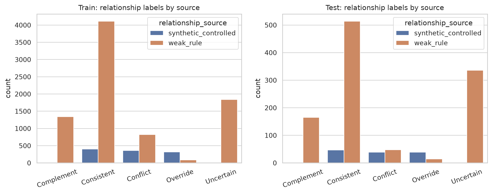

## 3. Overall performance (natural test instances)

Values are mean ± std over seeds with a 95% bootstrap CI over instances (pooled over seeds) in brackets. Recall@K equals Hit@K because each instance has exactly one target.

| model | n | Hit@10 | NDCG@10 | MRR@10 | Hit@20 | NDCG@20 |
|---|---|---|---|---|---|---|
| LTP-only | 1077 | 0.052 ± 0.002 [0.044, 0.062] | 0.029 ± 0.001 [0.025, 0.036] | 0.023 ± 0.001 [0.018, 0.028] | 0.077 ± 0.004 [0.066, 0.089] | 0.036 ± 0.002 [0.031, 0.042] |
| STI-only | 1077 | 0.101 ± 0.003 [0.089, 0.113] | 0.053 ± 0.004 [0.046, 0.061] | 0.039 ± 0.004 [0.033, 0.046] | 0.147 ± 0.006 [0.133, 0.163] | 0.065 ± 0.004 [0.059, 0.073] |
| Naive fusion | 1077 | 0.087 ± 0.007 [0.078, 0.099] | 0.048 ± 0.005 [0.042, 0.056] | 0.036 ± 0.004 [0.030, 0.042] | 0.132 ± 0.001 [0.120, 0.146] | 0.059 ± 0.003 [0.053, 0.067] |
| Adaptive fusion | 1077 | 0.091 ± 0.001 [0.081, 0.104] | 0.051 ± 0.000 [0.045, 0.058] | 0.039 ± 0.001 [0.033, 0.045] | 0.134 ± 0.001 [0.121, 0.150] | 0.062 ± 0.001 [0.055, 0.070] |
| Sequential (GRU) | 1077 | 0.064 ± 0.000 [0.054, 0.074] | 0.037 ± 0.001 [0.031, 0.044] | 0.029 ± 0.001 [0.023, 0.035] | 0.103 ± 0.001 [0.088, 0.115] | 0.047 ± 0.001 [0.040, 0.055] |
| Conversation-aware | 1077 | 0.076 ± 0.001 [0.066, 0.085] | 0.045 ± 0.001 [0.039, 0.051] | 0.036 ± 0.000 [0.030, 0.042] | 0.122 ± 0.002 [0.109, 0.134] | 0.057 ± 0.000 [0.049, 0.064] |
| AIPA w/o relationship | 1077 | 0.100 ± 0.001 [0.089, 0.115] | 0.056 ± 0.000 [0.048, 0.065] | 0.043 ± 0.000 [0.036, 0.051] | 0.143 ± 0.004 [0.128, 0.157] | 0.067 ± 0.001 [0.059, 0.075] |
| AIPA w/o counterfactual | 1077 | 0.094 ± 0.005 [0.084, 0.105] | 0.052 ± 0.004 [0.045, 0.060] | 0.039 ± 0.003 [0.033, 0.045] | 0.141 ± 0.003 [0.127, 0.155] | 0.064 ± 0.003 [0.056, 0.071] |
| AIPA w/o clarification | 1077 | 0.089 ± 0.003 [0.078, 0.101] | 0.049 ± 0.003 [0.042, 0.056] | 0.037 ± 0.003 [0.031, 0.044] | 0.126 ± 0.003 [0.114, 0.138] | 0.058 ± 0.003 [0.051, 0.066] |
| AIPA w/o persistence | 1077 | 0.089 ± 0.000 [0.078, 0.101] | 0.051 ± 0.000 [0.044, 0.059] | 0.040 ± 0.001 [0.034, 0.048] | 0.141 ± 0.008 [0.126, 0.154] | 0.064 ± 0.002 [0.057, 0.073] |
| AIPA (rule policy) | 1077 | 0.085 ± 0.005 [0.074, 0.097] | 0.046 ± 0.003 [0.040, 0.054] | 0.035 ± 0.002 [0.029, 0.041] | 0.126 ± 0.004 [0.115, 0.138] | 0.057 ± 0.002 [0.050, 0.064] |
| AIPA (full) | 1077 | 0.089 ± 0.000 [0.078, 0.101] | 0.051 ± 0.001 [0.044, 0.059] | 0.040 ± 0.001 [0.034, 0.048] | 0.141 ± 0.007 [0.127, 0.155] | 0.064 ± 0.002 [0.057, 0.073] |

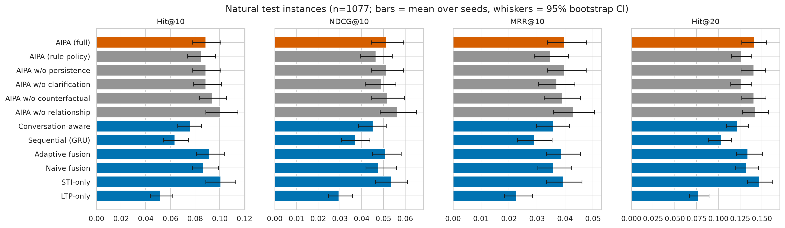

### Paired significance vs. baselines (natural, Hit@10)

| control | n | mean_diff | t_p | t_p_holm | wilcoxon_p | wilcoxon_p_holm | cohen_d | cliffs_delta |
|---|---|---|---|---|---|---|---|---|
| AIPA (rule policy) | 1077 | 0.0037 | 0.4579 | 1.0000 | 0.7731 | 1.0000 | 0.0226 | 0.0009 |
| AIPA w/o clarification | 1077 | 0.0000 | 1.0000 | 1.0000 | 0.9132 | 1.0000 | 0.0000 | -0.0061 |
| AIPA w/o counterfactual | 1077 | -0.0051 | 0.2967 | 1.0000 | 0.4368 | 1.0000 | -0.0318 | -0.0188 |
| AIPA w/o persistence | 1077 | 0.0000 | n/a | n/a | n/a | n/a | n/a | n/a |
| AIPA w/o relationship | 1077 | -0.0116 | 0.0378 | 0.3026 | 0.1863 | 1.0000 | -0.0634 | -0.0181 |
| Adaptive fusion | 1077 | -0.0028 | 0.5447 | 1.0000 | 0.6944 | 1.0000 | -0.0185 | -0.0030 |
| Conversation-aware | 1077 | 0.0125 | 0.0424 | 0.3026 | 0.4519 | 1.0000 | 0.0619 | 0.0145 |
| LTP-only | 1077 | 0.0371 | 0.0000 | 0.0000 | 0.0003 | 0.0036 | 0.1796 | 0.0502 |
| Naive fusion | 1077 | 0.0019 | 0.7196 | 1.0000 | 0.9661 | 1.0000 | 0.0109 | -0.0018 |
| STI-only | 1077 | -0.0121 | 0.0279 | 0.2513 | 0.1653 | 1.0000 | -0.0671 | -0.0159 |
| Sequential (GRU) | 1077 | 0.0251 | 0.0001 | 0.0011 | 0.0444 | 0.4437 | 0.1183 | 0.0282 |

## 4. Conflict-sensitive evaluation

### 4.1 Natural Conflict/Override subset (weak-rule labels; noisy)

| model | n | Hit@10 | NDCG@10 | MRR@10 | Hit@20 | NDCG@20 |
|---|---|---|---|---|---|---|
| LTP-only | 62 | 0.016 ± 0.016 [0.000, 0.040] | 0.013 ± 0.013 [0.000, 0.029] | 0.012 ± 0.012 [0.000, 0.028] | 0.032 ± 0.016 [0.008, 0.065] | 0.017 ± 0.013 [0.002, 0.038] |
| STI-only | 62 | 0.113 ± 0.016 [0.056, 0.177] | 0.046 ± 0.000 [0.022, 0.075] | 0.026 ± 0.005 [0.011, 0.048] | 0.210 ± 0.016 [0.145, 0.274] | 0.069 ± 0.000 [0.046, 0.099] |
| Naive fusion | 62 | 0.065 ± 0.016 [0.024, 0.113] | 0.036 ± 0.002 [0.013, 0.065] | 0.026 ± 0.002 [0.007, 0.051] | 0.129 ± 0.000 [0.073, 0.185] | 0.052 ± 0.001 [0.027, 0.084] |
| Adaptive fusion | 62 | 0.048 ± 0.000 [0.016, 0.089] | 0.019 ± 0.001 [0.006, 0.036] | 0.010 ± 0.001 [0.003, 0.020] | 0.129 ± 0.016 [0.080, 0.186] | 0.040 ± 0.005 [0.024, 0.063] |
| Sequential (GRU) | 62 | 0.032 ± 0.032 [0.008, 0.073] | 0.017 ± 0.017 [0.003, 0.036] | 0.013 ± 0.013 [0.001, 0.028] | 0.065 ± 0.048 [0.024, 0.113] | 0.025 ± 0.021 [0.008, 0.046] |
| Conversation-aware | 62 | 0.073 ± 0.024 [0.024, 0.113] | 0.040 ± 0.017 [0.014, 0.072] | 0.030 ± 0.015 [0.008, 0.061] | 0.137 ± 0.056 [0.089, 0.202] | 0.057 ± 0.026 [0.030, 0.086] |
| AIPA w/o relationship | 62 | 0.113 ± 0.016 [0.056, 0.177] | 0.052 ± 0.012 [0.026, 0.085] | 0.033 ± 0.011 [0.015, 0.060] | 0.161 ± 0.016 [0.105, 0.234] | 0.064 ± 0.012 [0.036, 0.098] |
| AIPA w/o counterfactual | 62 | 0.105 ± 0.024 [0.048, 0.161] | 0.052 ± 0.011 [0.022, 0.086] | 0.036 ± 0.008 [0.015, 0.066] | 0.161 ± 0.016 [0.105, 0.226] | 0.066 ± 0.009 [0.038, 0.104] |
| AIPA w/o clarification | 62 | 0.105 ± 0.008 [0.056, 0.161] | 0.053 ± 0.000 [0.023, 0.089] | 0.038 ± 0.003 [0.014, 0.070] | 0.153 ± 0.040 [0.105, 0.218] | 0.065 ± 0.007 [0.037, 0.103] |
| AIPA w/o persistence | 62 | 0.056 ± 0.008 [0.016, 0.105] | 0.033 ± 0.005 [0.011, 0.063] | 0.026 ± 0.004 [0.007, 0.050] | 0.153 ± 0.008 [0.097, 0.218] | 0.058 ± 0.004 [0.032, 0.089] |
| AIPA (rule policy) | 62 | 0.073 ± 0.008 [0.032, 0.129] | 0.040 ± 0.004 [0.016, 0.072] | 0.029 ± 0.004 [0.011, 0.053] | 0.137 ± 0.008 [0.089, 0.202] | 0.056 ± 0.000 [0.031, 0.088] |
| AIPA (full) | 62 | 0.056 ± 0.008 [0.016, 0.105] | 0.033 ± 0.005 [0.011, 0.063] | 0.026 ± 0.004 [0.007, 0.050] | 0.153 ± 0.008 [0.097, 0.218] | 0.058 ± 0.004 [0.032, 0.089] |

### 4.2 Natural non-conflict subset

| model | n | Hit@10 | NDCG@10 | MRR@10 | Hit@20 | NDCG@20 |
|---|---|---|---|---|---|---|
| LTP-only | 1015 | 0.054 ± 0.003 [0.043, 0.063] | 0.030 ± 0.002 [0.025, 0.037] | 0.023 ± 0.002 [0.018, 0.029] | 0.080 ± 0.005 [0.070, 0.091] | 0.037 ± 0.002 [0.032, 0.043] |
| STI-only | 1015 | 0.100 ± 0.002 [0.087, 0.113] | 0.054 ± 0.004 [0.046, 0.062] | 0.040 ± 0.004 [0.034, 0.046] | 0.143 ± 0.005 [0.129, 0.159] | 0.065 ± 0.005 [0.057, 0.073] |
| Naive fusion | 1015 | 0.088 ± 0.006 [0.076, 0.101] | 0.048 ± 0.005 [0.041, 0.056] | 0.036 ± 0.004 [0.030, 0.044] | 0.132 ± 0.001 [0.119, 0.147] | 0.059 ± 0.003 [0.052, 0.068] |
| Adaptive fusion | 1015 | 0.094 ± 0.001 [0.081, 0.108] | 0.053 ± 0.000 [0.045, 0.062] | 0.040 ± 0.001 [0.033, 0.048] | 0.134 ± 0.000 [0.118, 0.150] | 0.063 ± 0.001 [0.054, 0.072] |
| Sequential (GRU) | 1015 | 0.066 ± 0.001 [0.055, 0.078] | 0.038 ± 0.000 [0.031, 0.045] | 0.030 ± 0.000 [0.023, 0.036] | 0.105 ± 0.002 [0.093, 0.117] | 0.048 ± 0.000 [0.041, 0.055] |
| Conversation-aware | 1015 | 0.076 ± 0.000 [0.064, 0.087] | 0.045 ± 0.001 [0.037, 0.054] | 0.036 ± 0.000 [0.029, 0.043] | 0.121 ± 0.006 [0.106, 0.135] | 0.057 ± 0.002 [0.049, 0.065] |
| AIPA w/o relationship | 1015 | 0.100 ± 0.000 [0.086, 0.112] | 0.057 ± 0.001 [0.048, 0.064] | 0.044 ± 0.001 [0.037, 0.052] | 0.141 ± 0.003 [0.127, 0.155] | 0.067 ± 0.000 [0.059, 0.075] |
| AIPA w/o counterfactual | 1015 | 0.093 ± 0.003 [0.081, 0.108] | 0.052 ± 0.003 [0.044, 0.060] | 0.039 ± 0.003 [0.033, 0.047] | 0.139 ± 0.002 [0.124, 0.153] | 0.063 ± 0.003 [0.056, 0.072] |
| AIPA w/o clarification | 1015 | 0.088 ± 0.004 [0.074, 0.101] | 0.049 ± 0.003 [0.041, 0.057] | 0.037 ± 0.002 [0.031, 0.044] | 0.124 ± 0.006 [0.108, 0.138] | 0.058 ± 0.003 [0.050, 0.067] |
| AIPA w/o persistence | 1015 | 0.091 ± 0.000 [0.077, 0.101] | 0.052 ± 0.001 [0.044, 0.061] | 0.041 ± 0.001 [0.033, 0.049] | 0.140 ± 0.009 [0.126, 0.155] | 0.065 ± 0.003 [0.056, 0.072] |
| AIPA (rule policy) | 1015 | 0.086 ± 0.005 [0.073, 0.098] | 0.047 ± 0.002 [0.040, 0.055] | 0.035 ± 0.002 [0.029, 0.042] | 0.126 ± 0.004 [0.111, 0.138] | 0.057 ± 0.002 [0.049, 0.065] |
| AIPA (full) | 1015 | 0.091 ± 0.000 [0.077, 0.101] | 0.052 ± 0.001 [0.044, 0.061] | 0.041 ± 0.001 [0.033, 0.049] | 0.140 ± 0.008 [0.126, 0.155] | 0.065 ± 0.003 [0.057, 0.072] |

### 4.3 Controlled synthetic Conflict/Override subset

Targets on this subset are *sampled* items that match the injected intent; the numbers measure whether a system follows a clearly expressed short-term intent, not accuracy on human recommendations.

| model | n | Hit@10 | NDCG@10 | MRR@10 | Hit@20 | NDCG@20 |
|---|---|---|---|---|---|---|
| LTP-only | 78 | 0.038 ± 0.013 [0.006, 0.071] | 0.014 ± 0.002 [0.002, 0.027] | 0.007 ± 0.000 [0.001, 0.013] | 0.051 ± 0.013 [0.013, 0.083] | 0.017 ± 0.002 [0.004, 0.030] |
| STI-only | 78 | 0.224 ± 0.006 [0.154, 0.295] | 0.107 ± 0.012 [0.070, 0.140] | 0.072 ± 0.014 [0.045, 0.102] | 0.372 ± 0.026 [0.307, 0.442] | 0.144 ± 0.018 [0.108, 0.180] |
| Naive fusion | 78 | 0.186 ± 0.006 [0.135, 0.244] | 0.100 ± 0.004 [0.067, 0.139] | 0.075 ± 0.003 [0.044, 0.108] | 0.321 ± 0.026 [0.250, 0.404] | 0.135 ± 0.004 [0.097, 0.173] |
| Adaptive fusion | 78 | 0.205 ± 0.013 [0.135, 0.269] | 0.101 ± 0.018 [0.066, 0.130] | 0.069 ± 0.019 [0.042, 0.094] | 0.372 ± 0.026 [0.288, 0.442] | 0.143 ± 0.022 [0.109, 0.178] |
| Sequential (GRU) | 78 | 0.032 ± 0.006 [0.006, 0.058] | 0.012 ± 0.002 [0.003, 0.023] | 0.006 ± 0.001 [0.002, 0.012] | 0.032 ± 0.006 [0.006, 0.058] | 0.012 ± 0.002 [0.003, 0.023] |
| Conversation-aware | 78 | 0.038 ± 0.013 [0.013, 0.071] | 0.015 ± 0.006 [0.004, 0.026] | 0.008 ± 0.004 [0.002, 0.015] | 0.064 ± 0.026 [0.026, 0.109] | 0.021 ± 0.009 [0.009, 0.036] |
| AIPA w/o relationship | 78 | 0.199 ± 0.006 [0.141, 0.257] | 0.103 ± 0.000 [0.070, 0.137] | 0.074 ± 0.002 [0.045, 0.103] | 0.372 ± 0.026 [0.295, 0.462] | 0.147 ± 0.005 [0.113, 0.181] |
| AIPA w/o counterfactual | 78 | 0.231 ± 0.013 [0.160, 0.289] | 0.108 ± 0.000 [0.075, 0.141] | 0.071 ± 0.003 [0.046, 0.099] | 0.372 ± 0.013 [0.301, 0.449] | 0.144 ± 0.006 [0.110, 0.180] |
| AIPA w/o clarification | 78 | 0.218 ± 0.000 [0.154, 0.282] | 0.107 ± 0.008 [0.070, 0.143] | 0.073 ± 0.011 [0.046, 0.107] | 0.397 ± 0.013 [0.314, 0.481] | 0.152 ± 0.012 [0.114, 0.192] |
| AIPA w/o persistence | 78 | 0.224 ± 0.032 [0.160, 0.295] | 0.105 ± 0.012 [0.070, 0.146] | 0.070 ± 0.005 [0.044, 0.103] | 0.359 ± 0.013 [0.282, 0.429] | 0.139 ± 0.007 [0.105, 0.176] |
| AIPA (rule policy) | 78 | 0.186 ± 0.032 [0.128, 0.244] | 0.095 ± 0.014 [0.064, 0.128] | 0.068 ± 0.009 [0.041, 0.097] | 0.410 ± 0.000 [0.333, 0.494] | 0.151 ± 0.007 [0.118, 0.186] |
| AIPA (full) | 78 | 0.224 ± 0.032 [0.160, 0.295] | 0.105 ± 0.012 [0.070, 0.146] | 0.070 ± 0.005 [0.044, 0.103] | 0.359 ± 0.013 [0.282, 0.429] | 0.139 ± 0.007 [0.105, 0.176] |

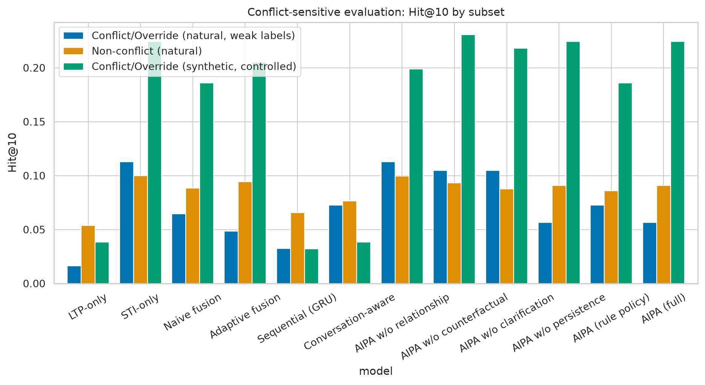

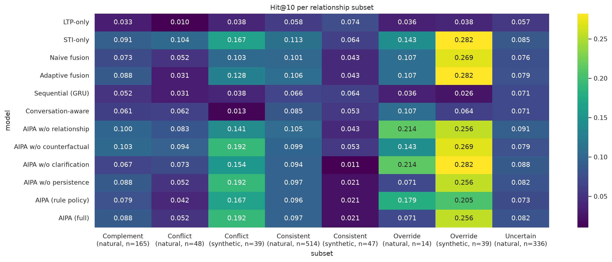

### 4.4 Paired significance on conflict subsets (Hit@10)

| subset | control | n | mean_diff | wilcoxon_p | wilcoxon_p_holm | cohen_d | cliffs_delta |
|---|---|---|---|---|---|---|---|
| conflict_natural | AIPA (rule policy) | 62 | -0.0161 | 0.8068 | 1.0000 | -0.1034 | -0.0169 |
| conflict_natural | AIPA w/o clarification | 62 | -0.0484 | 0.3430 | 1.0000 | -0.2463 | -0.0650 |
| conflict_natural | AIPA w/o counterfactual | 62 | -0.0484 | 0.2427 | 1.0000 | -0.2775 | -0.0793 |
| conflict_natural | AIPA w/o persistence | 62 | 0.0000 | n/a | n/a | n/a | n/a |
| conflict_natural | AIPA w/o relationship | 62 | -0.0565 | 0.1778 | 1.0000 | -0.2760 | -0.0950 |
| conflict_natural | Adaptive fusion | 62 | 0.0081 | 0.8098 | 1.0000 | 0.0729 | 0.0156 |
| conflict_natural | Conversation-aware | 62 | -0.0161 | 0.6450 | 1.0000 | -0.1034 | -0.0312 |
| conflict_natural | LTP-only | 62 | 0.0403 | 0.3430 | 1.0000 | 0.2452 | 0.0494 |
| conflict_natural | Naive fusion | 62 | -0.0081 | 0.8098 | 1.0000 | -0.0729 | -0.0156 |
| conflict_natural | STI-only | 62 | -0.0565 | 0.1670 | 1.0000 | -0.3078 | -0.0950 |
| conflict_natural | Sequential (GRU) | 62 | 0.0242 | 0.6459 | 1.0000 | 0.1147 | 0.0182 |
| conflict_synthetic | AIPA (rule policy) | 78 | 0.0385 | 0.3530 | 1.0000 | 0.1454 | 0.0307 |
| conflict_synthetic | AIPA w/o clarification | 78 | 0.0064 | 0.8569 | 1.0000 | 0.0209 | -0.0102 |
| conflict_synthetic | AIPA w/o counterfactual | 78 | -0.0064 | 0.6025 | 1.0000 | -0.0246 | -0.0251 |
| conflict_synthetic | AIPA w/o persistence | 78 | 0.0000 | n/a | n/a | n/a | n/a |
| conflict_synthetic | AIPA w/o relationship | 78 | 0.0256 | 0.5522 | 1.0000 | 0.1132 | 0.0299 |
| conflict_synthetic | Adaptive fusion | 78 | 0.0192 | 0.6896 | 1.0000 | 0.0821 | 0.0048 |
| conflict_synthetic | Conversation-aware | 78 | 0.1859 | 0.0002 | 0.0016 | 0.5577 | 0.2558 |
| conflict_synthetic | LTP-only | 78 | 0.1859 | 0.0001 | 0.0010 | 0.5748 | 0.2558 |
| conflict_synthetic | Naive fusion | 78 | 0.0385 | 0.4339 | 1.0000 | 0.1454 | 0.0661 |
| conflict_synthetic | STI-only | 78 | 0.0000 | 1.0000 | 1.0000 | 0.0000 | -0.0141 |
| conflict_synthetic | Sequential (GRU) | 78 | 0.1923 | 0.0001 | 0.0006 | 0.5924 | 0.2597 |

## 5. Relationship classification, arbitration and clarification

| model | subset | accuracy | macro_precision | macro_recall | macro_f1 | weighted_f1 | F1_Complement | F1_Consistent | F1_Conflict | F1_Override | F1_Uncertain |
|---|---|---|---|---|---|---|---|---|---|---|---|
| AIPA (full) | all | 0.753 | 0.659 | 0.682 | 0.659 | 0.744 | 0.299 | 0.802 | 0.465 | 0.801 | 0.930 |
| AIPA (full) | natural | 0.728 | 0.525 | 0.559 | 0.524 | 0.725 | 0.301 | 0.785 | 0.195 | 0.410 | 0.930 |
| AIPA (full) | synthetic | 0.972 | 0.594 | 0.582 | 0.587 | 0.979 | 0.000 | 0.984 | 0.953 | 1.000 | 0.000 |
| AIPA (rule policy) | all | 0.760 | 0.679 | 0.681 | 0.661 | 0.747 | 0.310 | 0.811 | 0.479 | 0.788 | 0.919 |
| AIPA (rule policy) | natural | 0.736 | 0.539 | 0.555 | 0.520 | 0.728 | 0.311 | 0.797 | 0.202 | 0.371 | 0.919 |
| AIPA (rule policy) | synthetic | 0.964 | 0.588 | 0.577 | 0.581 | 0.969 | 0.000 | 0.969 | 0.938 | 1.000 | 0.000 |
| AIPA w/o clarification | all | 0.782 | 0.712 | 0.694 | 0.691 | 0.768 | 0.326 | 0.827 | 0.541 | 0.825 | 0.938 |
| AIPA w/o clarification | natural | 0.760 | 0.569 | 0.557 | 0.550 | 0.749 | 0.327 | 0.814 | 0.274 | 0.397 | 0.938 |
| AIPA w/o clarification | synthetic | 0.972 | 0.590 | 0.582 | 0.585 | 0.976 | 0.000 | 0.980 | 0.953 | 0.994 | 0.000 |
| AIPA w/o counterfactual | all | 0.771 | 0.692 | 0.687 | 0.683 | 0.760 | 0.336 | 0.818 | 0.497 | 0.838 | 0.928 |
| AIPA w/o counterfactual | natural | 0.749 | 0.551 | 0.559 | 0.546 | 0.740 | 0.340 | 0.804 | 0.203 | 0.456 | 0.928 |
| AIPA w/o counterfactual | synthetic | 0.960 | 0.592 | 0.574 | 0.582 | 0.971 | 0.000 | 0.979 | 0.932 | 1.000 | 0.000 |
| AIPA w/o persistence | all | 0.753 | 0.658 | 0.682 | 0.659 | 0.744 | 0.299 | 0.801 | 0.464 | 0.801 | 0.930 |
| AIPA w/o persistence | natural | 0.727 | 0.525 | 0.559 | 0.524 | 0.725 | 0.301 | 0.785 | 0.194 | 0.410 | 0.930 |
| AIPA w/o persistence | synthetic | 0.972 | 0.594 | 0.582 | 0.587 | 0.979 | 0.000 | 0.984 | 0.953 | 1.000 | 0.000 |
| AIPA w/o relationship | all | 0.767 | 0.676 | 0.675 | 0.663 | 0.750 | 0.270 | 0.811 | 0.488 | 0.804 | 0.943 |
| AIPA w/o relationship | natural | 0.743 | 0.528 | 0.537 | 0.516 | 0.729 | 0.271 | 0.797 | 0.183 | 0.385 | 0.943 |
| AIPA w/o relationship | synthetic | 0.972 | 0.590 | 0.582 | 0.585 | 0.975 | 0.000 | 0.974 | 0.953 | 1.000 | 0.000 |

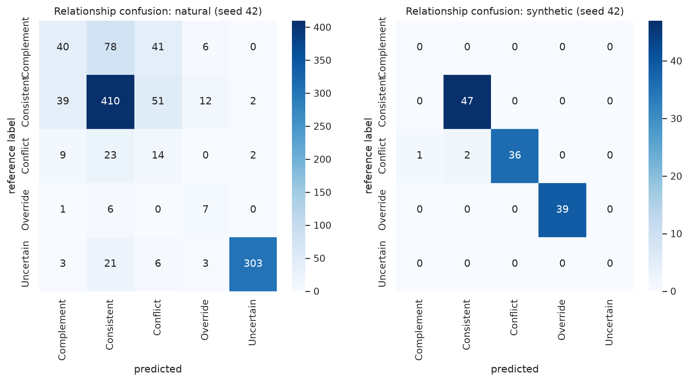

### Arbitration and clarification metrics (mean over seeds)

| model | subset | arbitration_accuracy | conflict_resolution_accuracy | conflict_arbitration_f1 | override_success_rate | clarification_rate | clarification_precision | clarification_efficiency | unnecessary_clarification_rate | wrong_override_rate | n | n_conflict | n_asked |
|---|---|---|---|---|---|---|---|---|---|---|---|---|---|
| AIPA (full) | all | 0.879 | 0.589 | 0.371 | 0.237 | 0.182 | 0.984 | 0.607 | 0.003 | 0.017 | 1202.000 | 140.000 | 218.500 |
| AIPA (full) | natural | 0.872 | 0.202 | 0.166 | 0.134 | 0.203 | 0.984 | 0.607 | 0.003 | 0.019 | 1077.000 | 62.000 | 218.500 |
| AIPA (full) | synthetic | 0.936 | 0.897 | 0.473 | 0.256 | 0.000 | n/a | n/a | 0.000 | 0.000 | 125.000 | 78.000 | 0.000 |
| AIPA (rule policy) | all | 0.817 | 0.654 | 0.263 | 0.219 | 0.258 | 0.713 | 0.624 | 0.074 | 0.026 | 1202.000 | 140.000 | 310.500 |
| AIPA (rule policy) | natural | 0.800 | 0.298 | 0.150 | 0.311 | 0.286 | 0.718 | 0.624 | 0.081 | 0.029 | 1077.000 | 62.000 | 308.500 |
| AIPA (rule policy) | synthetic | 0.960 | 0.936 | 0.322 | 0.205 | 0.016 | 0.000 | n/a | 0.016 | 0.000 | 125.000 | 78.000 | 2.000 |
| AIPA w/o clarification | all | 0.712 | 0.550 | 0.355 | 0.321 | 0.000 | n/a | 0.000 | 0.000 | 0.007 | 1202.000 | 140.000 | 0.000 |
| AIPA w/o clarification | natural | 0.688 | 0.153 | 0.132 | 0.583 | 0.000 | n/a | 0.000 | 0.000 | 0.007 | 1077.000 | 62.000 | 0.000 |
| AIPA w/o clarification | synthetic | 0.916 | 0.865 | 0.464 | 0.293 | 0.000 | n/a | n/a | 0.000 | 0.000 | 125.000 | 78.000 | 0.000 |
| AIPA w/o counterfactual | all | 0.889 | 0.586 | 0.369 | 0.267 | 0.178 | 0.988 | 0.599 | 0.002 | 0.008 | 1202.000 | 140.000 | 214.500 |
| AIPA w/o counterfactual | natural | 0.884 | 0.202 | 0.168 | 0.250 | 0.199 | 0.988 | 0.599 | 0.002 | 0.009 | 1077.000 | 62.000 | 214.500 |
| AIPA w/o counterfactual | synthetic | 0.932 | 0.891 | 0.471 | 0.269 | 0.000 | n/a | n/a | 0.000 | 0.000 | 125.000 | 78.000 | 0.000 |
| AIPA w/o persistence | all | 0.879 | 0.589 | 0.371 | 0.237 | 0.182 | 0.984 | 0.607 | 0.003 | 0.017 | 1202.000 | 140.000 | 218.500 |
| AIPA w/o persistence | natural | 0.872 | 0.202 | 0.166 | 0.134 | 0.203 | 0.984 | 0.607 | 0.003 | 0.019 | 1077.000 | 62.000 | 218.500 |
| AIPA w/o persistence | synthetic | 0.936 | 0.897 | 0.473 | 0.256 | 0.000 | n/a | n/a | 0.000 | 0.000 | 125.000 | 78.000 | 0.000 |
| AIPA w/o relationship | all | 0.886 | 0.568 | 0.362 | 0.270 | 0.183 | 0.987 | 0.612 | 0.002 | 0.010 | 1202.000 | 140.000 | 219.500 |
| AIPA w/o relationship | natural | 0.881 | 0.161 | 0.138 | 0.383 | 0.204 | 0.987 | 0.612 | 0.003 | 0.012 | 1077.000 | 62.000 | 219.500 |
| AIPA w/o relationship | synthetic | 0.932 | 0.891 | 0.471 | 0.256 | 0.000 | n/a | n/a | 0.000 | 0.000 | 125.000 | 78.000 | 0.000 |

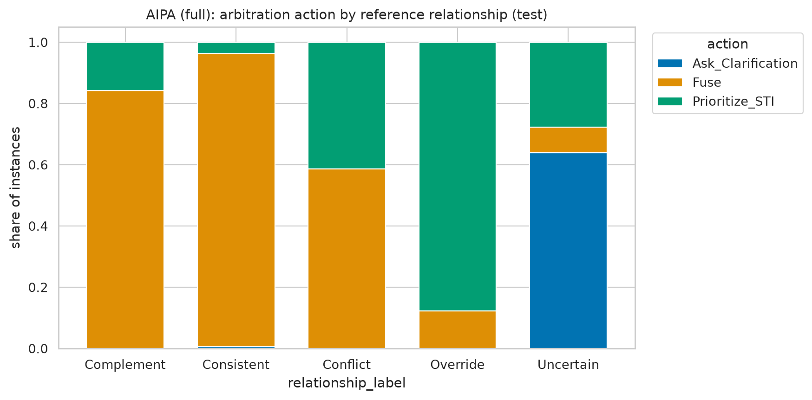

### Calibration of the relationship classifier

| model | subset | ECE | Brier |
|---|---|---|---|
| AIPA (full) | all | 0.047 | 0.065 |
| AIPA (full) | natural | 0.051 | 0.072 |
| AIPA (full) | synthetic | 0.084 | 0.016 |
| AIPA (rule policy) | all | 0.066 | 0.066 |
| AIPA (rule policy) | natural | 0.078 | 0.073 |
| AIPA (rule policy) | synthetic | 0.043 | 0.017 |
| AIPA w/o clarification | all | 0.056 | 0.061 |
| AIPA w/o clarification | natural | 0.068 | 0.067 |
| AIPA w/o clarification | synthetic | 0.054 | 0.019 |
| AIPA w/o counterfactual | all | 0.041 | 0.062 |
| AIPA w/o counterfactual | natural | 0.050 | 0.068 |
| AIPA w/o counterfactual | synthetic | 0.049 | 0.018 |
| AIPA w/o persistence | all | 0.044 | 0.066 |
| AIPA w/o persistence | natural | 0.048 | 0.072 |
| AIPA w/o persistence | synthetic | 0.084 | 0.016 |
| AIPA w/o relationship | all | 0.036 | 0.063 |
| AIPA w/o relationship | natural | 0.038 | 0.068 |
| AIPA w/o relationship | synthetic | 0.076 | 0.019 |

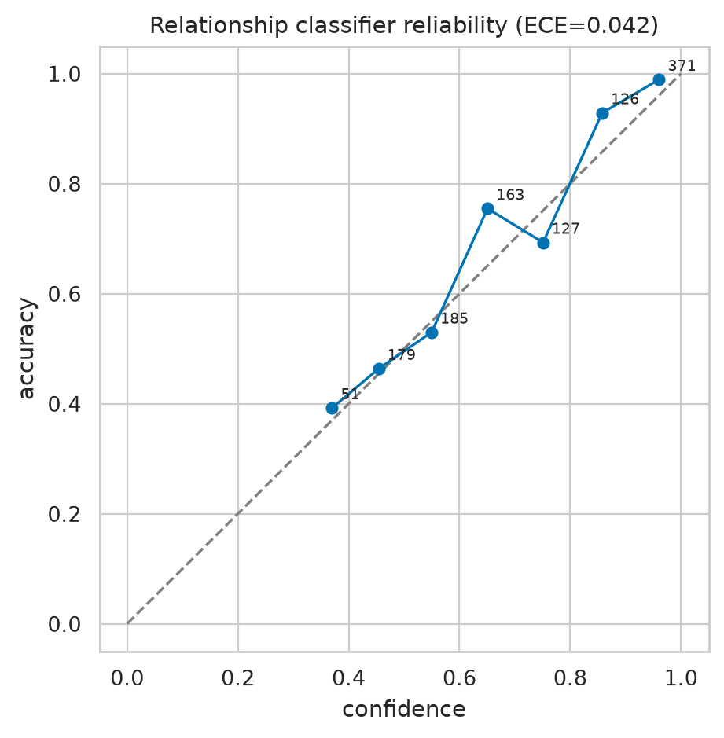

## 6. Counterfactual driver diagnostic (model-based)

LTP or STI encodings of the trained AIPA model are set to zero and the fused ranking is recomputed. Δ NDCG@10 and top-10 overlap quantify how much each signal drove the factual ranking; driver labels use a top-K disagreement threshold τ = 0.1 and a dominance ratio of 1.5 (a signal is the sole driver when its disruption is at least 1.5x the other; both above τ without dominance = jointly driven; both below τ = neither). This is an interventional diagnostic of the *model*, not an estimate of causal effects.

| is_synthetic | relationship_label | n | mean_abs_delta_ndcg_LTP | mean_abs_delta_ndcg_STI | mean_delta_ndcg_LTP | mean_delta_ndcg_STI | overlap10_noLTP | overlap10_noSTI | STI_driven | LTP_driven | Jointly_driven | Neither_driven |
|---|---|---|---|---|---|---|---|---|---|---|---|---|
| False | Complement | 165 | 0.018 | 0.049 | 0.002 | 0.037 | 0.642 | 0.161 | 0.500 | 0.000 | 0.500 | 0.000 |
| False | Conflict | 48 | 0.020 | 0.030 | 0.004 | 0.016 | 0.642 | 0.142 | 0.490 | 0.010 | 0.500 | 0.000 |
| False | Consistent | 514 | 0.025 | 0.051 | 0.006 | 0.035 | 0.622 | 0.238 | 0.462 | 0.004 | 0.534 | 0.000 |
| False | Override | 14 | 0.019 | 0.018 | -0.016 | 0.018 | 0.739 | 0.096 | 0.536 | 0.000 | 0.464 | 0.000 |
| False | Uncertain | 336 | 0.012 | 0.050 | 0.000 | 0.028 | 0.740 | 0.241 | 0.598 | 0.004 | 0.397 | 0.000 |
| True | Conflict | 39 | 0.023 | 0.068 | 0.014 | 0.068 | 0.832 | 0.063 | 0.731 | 0.000 | 0.269 | 0.000 |
| True | Consistent | 47 | 0.017 | 0.025 | -0.004 | 0.011 | 0.595 | 0.245 | 0.500 | 0.011 | 0.489 | 0.000 |
| True | Override | 39 | 0.026 | 0.134 | -0.001 | 0.134 | 0.887 | 0.063 | 0.667 | 0.000 | 0.333 | 0.000 |

| model | subset | STI_driven_rate | LTP_driven_rate | Jointly_driven_rate | Neither_driven_rate | mean_abs_delta_LTP | mean_abs_delta_STI | mean_topk_overlap_noLTP | mean_topk_overlap_noSTI | n |
|---|---|---|---|---|---|---|---|---|---|---|
| AIPA (full) | all | 0.524 | 0.004 | 0.472 | 0.000 | 0.538 | 0.864 | 0.462 | 0.136 | 1202.000 |
| AIPA (full) | natural | 0.513 | 0.004 | 0.484 | 0.000 | 0.537 | 0.859 | 0.463 | 0.141 | 1077.000 |
| AIPA (full) | synthetic | 0.624 | 0.004 | 0.372 | 0.000 | 0.541 | 0.908 | 0.459 | 0.092 | 125.000 |
| AIPA (rule policy) | all | 0.485 | 0.007 | 0.509 | 0.000 | 0.578 | 0.885 | 0.422 | 0.115 | 1202.000 |
| AIPA (rule policy) | natural | 0.475 | 0.006 | 0.518 | 0.000 | 0.577 | 0.881 | 0.423 | 0.119 | 1077.000 |
| AIPA (rule policy) | synthetic | 0.564 | 0.008 | 0.428 | 0.000 | 0.589 | 0.914 | 0.411 | 0.086 | 125.000 |
| AIPA w/o clarification | all | 0.402 | 0.006 | 0.592 | 0.000 | 0.616 | 0.883 | 0.384 | 0.117 | 1202.000 |
| AIPA w/o clarification | natural | 0.396 | 0.006 | 0.598 | 0.000 | 0.614 | 0.878 | 0.386 | 0.122 | 1077.000 |
| AIPA w/o clarification | synthetic | 0.456 | 0.008 | 0.536 | 0.000 | 0.634 | 0.921 | 0.366 | 0.079 | 125.000 |
| AIPA w/o counterfactual | all | 0.466 | 0.007 | 0.526 | 0.000 | 0.586 | 0.883 | 0.414 | 0.117 | 1202.000 |
| AIPA w/o counterfactual | natural | 0.452 | 0.008 | 0.540 | 0.000 | 0.585 | 0.878 | 0.415 | 0.122 | 1077.000 |
| AIPA w/o counterfactual | synthetic | 0.588 | 0.004 | 0.408 | 0.000 | 0.595 | 0.924 | 0.405 | 0.076 | 125.000 |
| AIPA w/o persistence | all | 0.526 | 0.004 | 0.470 | 0.000 | 0.538 | 0.864 | 0.462 | 0.136 | 1202.000 |
| AIPA w/o persistence | natural | 0.514 | 0.004 | 0.482 | 0.000 | 0.538 | 0.859 | 0.462 | 0.141 | 1077.000 |
| AIPA w/o persistence | synthetic | 0.624 | 0.004 | 0.372 | 0.000 | 0.541 | 0.908 | 0.459 | 0.092 | 125.000 |
| AIPA w/o relationship | all | 0.465 | 0.004 | 0.530 | 0.000 | 0.558 | 0.858 | 0.442 | 0.142 | 1202.000 |
| AIPA w/o relationship | natural | 0.451 | 0.005 | 0.545 | 0.000 | 0.557 | 0.852 | 0.443 | 0.148 | 1077.000 |
| AIPA w/o relationship | synthetic | 0.592 | 0.000 | 0.408 | 0.000 | 0.570 | 0.916 | 0.430 | 0.084 | 125.000 |

Driver-action agreement (share of instances where the diagnostic driver matches the chosen arbitration action):

| is_synthetic | agreement |
|---|---|
| False | 0.456 |
| True | 0.620 |

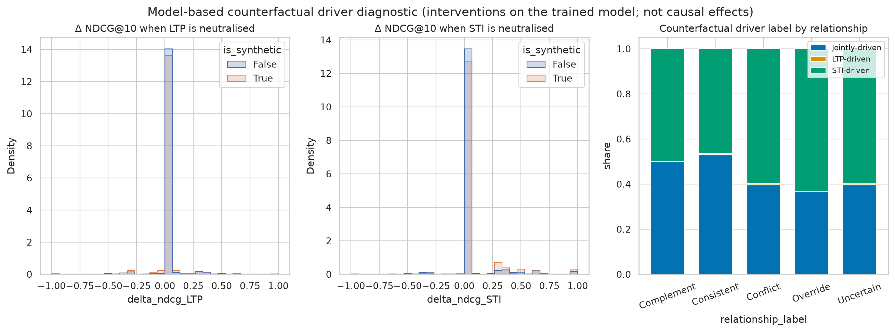

## 7. Temporary override vs. persistent preference shift

Persistent shifts detected on the test set (genre prioritised in ≥ 2 distinct sessions of a seeker): **33** across 2 seed(s).

| model | seed | seeker_id | genre | conv_id |
|---|---|---|---|---|
| AIPA w/o relationship | 42 | 1008 | Horror | 21026 |
| AIPA w/o relationship | 42 | 1087 | War | 22841 |
| AIPA w/o counterfactual | 42 | 1008 | Horror | 21026 |
| AIPA w/o counterfactual | 42 | 1087 | War | 22841 |
| AIPA w/o clarification | 42 | 1087 | War | 22841 |
| AIPA (rule policy) | 42 | 1035 | Comedy | 22801 |
| AIPA (rule policy) | 42 | 1087 | War | 22841 |
| AIPA (full) | 42 | 1008 | Horror | 21026 |
| AIPA (full) | 42 | 1034 | Comedy | 22026 |
| AIPA (full) | 42 | 1035 | Comedy | 22801 |
| AIPA (full) | 42 | 1054 | Comedy | 22083 |
| AIPA (full) | 42 | 1059 | Crime | 23195 |
| AIPA (full) | 42 | 1087 | War | 22841 |
| AIPA (full) | 42 | 979 | Musical | 21644 |
| AIPA w/o relationship | 7 | 1008 | Horror | 21026 |
| AIPA w/o relationship | 7 | 1011 | Horror | 21073 |
| AIPA w/o relationship | 7 | 1087 | War | 22841 |
| AIPA w/o counterfactual | 7 | 1034 | Comedy | 22026 |
| AIPA w/o counterfactual | 7 | 1087 | War | 22841 |
| AIPA w/o clarification | 7 | 1035 | Comedy | 22036 |

## 8. Sensitivity analyses

### History length (LTP) - AIPA (full), natural

| history_bucket | n | Recall@10 | Hit@10 | NDCG@10 | MRR@10 | Recall@20 | Hit@20 | NDCG@20 | MRR@20 |
|---|---|---|---|---|---|---|---|---|---|
| 0-2 | 110 | 0.114 | 0.114 | 0.061 | 0.045 | 0.150 | 0.150 | 0.070 | 0.048 |
| 3-10 | 81 | 0.105 | 0.105 | 0.061 | 0.048 | 0.142 | 0.142 | 0.071 | 0.050 |
| 11-25 | 124 | 0.077 | 0.077 | 0.053 | 0.046 | 0.133 | 0.133 | 0.067 | 0.050 |
| 26-50 | 762 | 0.085 | 0.085 | 0.048 | 0.037 | 0.141 | 0.141 | 0.062 | 0.041 |

### STI context length - AIPA (full), natural

| sti_bucket | n | Recall@10 | Hit@10 | NDCG@10 | MRR@10 | Recall@20 | Hit@20 | NDCG@20 | MRR@20 |
|---|---|---|---|---|---|---|---|---|---|
| 1 | 111 | 0.144 | 0.144 | 0.079 | 0.059 | 0.198 | 0.198 | 0.093 | 0.063 |
| 2-3 | 356 | 0.081 | 0.081 | 0.046 | 0.035 | 0.136 | 0.136 | 0.060 | 0.039 |
| 4-6 | 424 | 0.088 | 0.088 | 0.055 | 0.045 | 0.138 | 0.138 | 0.068 | 0.049 |
| >6 | 186 | 0.070 | 0.070 | 0.036 | 0.025 | 0.124 | 0.124 | 0.049 | 0.028 |

### Synthetic conflict intensity (Conflict/Override, Hit@10 on injected target)

| model | 1 | 2 | 3 |
|---|---|---|---|
| AIPA (full) | 0.315 | 0.190 | 0.167 |
| AIPA (rule policy) | 0.259 | 0.143 | 0.150 |
| AIPA w/o clarification | 0.204 | 0.214 | 0.233 |
| AIPA w/o counterfactual | 0.222 | 0.214 | 0.250 |
| AIPA w/o persistence | 0.315 | 0.190 | 0.167 |
| AIPA w/o relationship | 0.241 | 0.167 | 0.183 |
| Adaptive fusion | 0.241 | 0.167 | 0.200 |
| Conversation-aware | 0.056 | 0.048 | 0.017 |
| LTP-only | 0.019 | 0.048 | 0.050 |
| Naive fusion | 0.204 | 0.167 | 0.183 |
| STI-only | 0.296 | 0.190 | 0.183 |
| Sequential (GRU) | 0.019 | 0.024 | 0.050 |

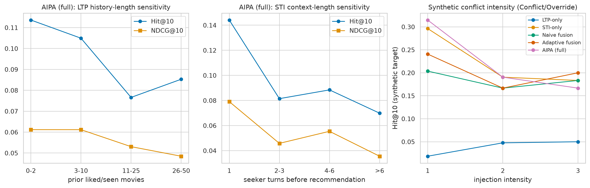

### Fixed fusion weight sweep

| alpha_ltp | Hit@10 | Recall@10 | NDCG@10 | MRR@10 | Hit@20 | Recall@20 | NDCG@20 | MRR@20 | Hit@10_synthetic |
|---|---|---|---|---|---|---|---|---|---|
| 0.000 | 0.081 | 0.081 | 0.045 | 0.034 | 0.125 | 0.125 | 0.056 | 0.037 | 0.120 |
| 0.250 | 0.088 | 0.088 | 0.047 | 0.035 | 0.133 | 0.133 | 0.058 | 0.038 | 0.132 |
| 0.500 | 0.087 | 0.087 | 0.048 | 0.036 | 0.132 | 0.132 | 0.059 | 0.039 | 0.132 |
| 0.750 | 0.077 | 0.077 | 0.041 | 0.030 | 0.112 | 0.112 | 0.050 | 0.032 | 0.112 |
| 1.000 | 0.022 | 0.022 | 0.012 | 0.008 | 0.049 | 0.049 | 0.018 | 0.010 | 0.012 |

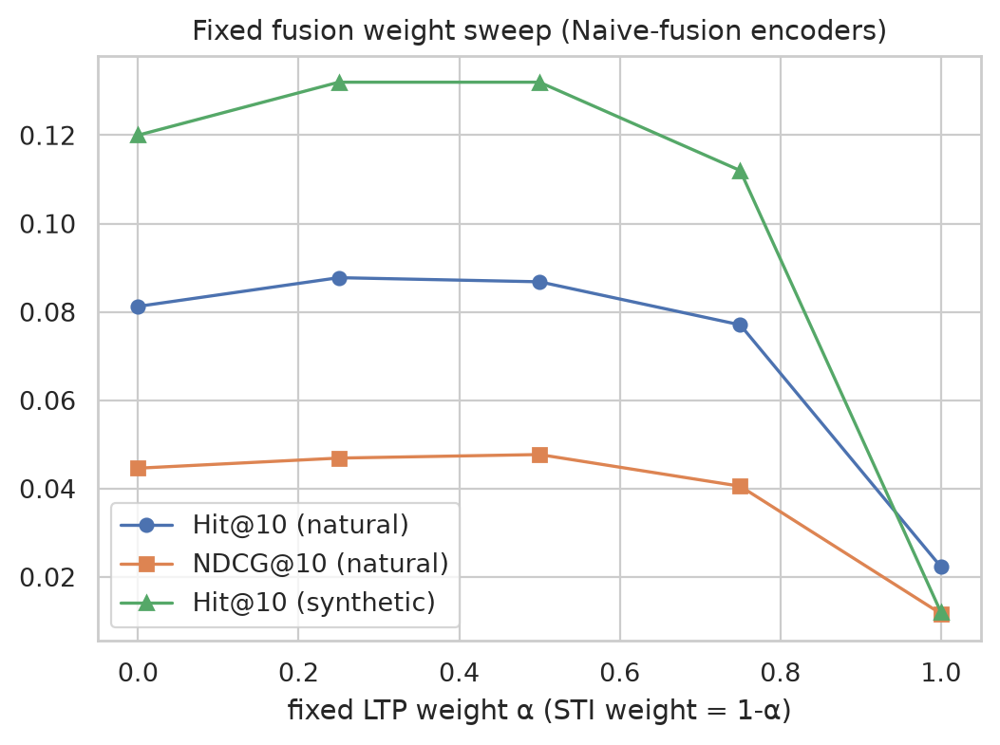

## 9. Ablations

| model | n | Hit@10 | NDCG@10 | MRR@10 |
|---|---|---|---|---|
| LTP-only | 1077 | 0.052 ± 0.002 [0.044, 0.062] | 0.029 ± 0.001 [0.025, 0.036] | 0.023 ± 0.001 [0.018, 0.028] |
| STI-only | 1077 | 0.101 ± 0.003 [0.089, 0.113] | 0.053 ± 0.004 [0.046, 0.061] | 0.039 ± 0.004 [0.033, 0.046] |
| Naive fusion | 1077 | 0.087 ± 0.007 [0.078, 0.099] | 0.048 ± 0.005 [0.042, 0.056] | 0.036 ± 0.004 [0.030, 0.042] |
| Adaptive fusion | 1077 | 0.091 ± 0.001 [0.081, 0.104] | 0.051 ± 0.000 [0.045, 0.058] | 0.039 ± 0.001 [0.033, 0.045] |
| AIPA w/o relationship | 1077 | 0.100 ± 0.001 [0.089, 0.115] | 0.056 ± 0.000 [0.048, 0.065] | 0.043 ± 0.000 [0.036, 0.051] |
| AIPA w/o counterfactual | 1077 | 0.094 ± 0.005 [0.084, 0.105] | 0.052 ± 0.004 [0.045, 0.060] | 0.039 ± 0.003 [0.033, 0.045] |
| AIPA w/o clarification | 1077 | 0.089 ± 0.003 [0.078, 0.101] | 0.049 ± 0.003 [0.042, 0.056] | 0.037 ± 0.003 [0.031, 0.044] |
| AIPA w/o persistence | 1077 | 0.089 ± 0.000 [0.078, 0.101] | 0.051 ± 0.000 [0.044, 0.059] | 0.040 ± 0.001 [0.034, 0.048] |
| AIPA (rule policy) | 1077 | 0.085 ± 0.005 [0.074, 0.097] | 0.046 ± 0.003 [0.040, 0.054] | 0.035 ± 0.002 [0.029, 0.041] |
| AIPA (full) | 1077 | 0.089 ± 0.000 [0.078, 0.101] | 0.051 ± 0.001 [0.044, 0.059] | 0.040 ± 0.001 [0.034, 0.048] |

Per-ablation verdicts (H3), natural Hit@10, AIPA (full) vs. ablation:

| ablation | verdict | mean_diff | p_holm |
|---|---|---|---|
| AIPA w/o relationship | NOT SUPPORTED (difference not significant) | -0.0116 | 1.0000 |
| AIPA w/o counterfactual | NOT SUPPORTED (difference not significant) | -0.0051 | 1.0000 |
| AIPA w/o clarification | NOT SUPPORTED (difference not significant) | 0.0000 | 1.0000 |
| AIPA w/o persistence | inconclusive (no variance between systems) | 0.0000 | n/a |
| AIPA (rule policy) | NOT SUPPORTED (difference not significant) | 0.0037 | 1.0000 |

## 10. Computational efficiency

| model | n_parameters | model_size_mb | train_time_s | epochs_run | inference_time_s | cpu_inference_ms_per_sample | gpu_peak_mem_mb |
|---|---|---|---|---|---|---|---|
| LTP-only | 515597 | 2.062 | 2.450 | 5.500 | 0.018 | 0.015 | n/a |
| STI-only | 515597 | 2.062 | 3.110 | 7.000 | 0.032 | 0.026 | n/a |
| Naive fusion | 515597 | 2.062 | 2.510 | 5.500 | 0.020 | 0.016 | n/a |
| Adaptive fusion | 526862 | 2.107 | 2.800 | 5.500 | 0.027 | 0.022 | n/a |
| Sequential (GRU) | 492877 | 1.972 | 7.970 | 6.500 | 0.041 | 0.034 | n/a |
| Conversation-aware | 476173 | 1.905 | 1.560 | 7.000 | 0.019 | 0.016 | n/a |
| AIPA w/o relationship | 547222 | 2.189 | 5.090 | 5.500 | 0.045 | 0.038 | n/a |
| AIPA w/o counterfactual | 547222 | 2.189 | 5.260 | 6.500 | 0.043 | 0.036 | n/a |
| AIPA w/o clarification | 547542 | 2.190 | 5.650 | 7.000 | 0.049 | 0.041 | n/a |
| AIPA w/o persistence | 547542 | 2.190 | 4.025 | 5.500 | 0.047 | 0.039 | n/a |
| AIPA (rule policy) | 535378 | 2.142 | 5.460 | 7.000 | 0.055 | 0.046 | n/a |
| AIPA (full) | 547542 | 2.190 | 4.020 | 5.500 | 0.052 | 0.044 | n/a |

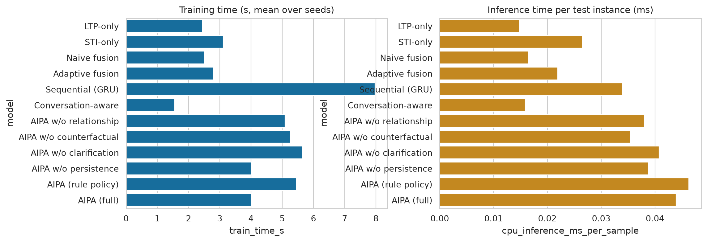

## 11. Error analysis

| subset | relationship_label | n | miss_rate@10 | relationship_error_rate | clarification_rate | mean_target_rank | median_target_rank | cold_seeker_share |
|---|---|---|---|---|---|---|---|---|
| natural | Complement | 165 | 0.912 | 0.770 | 0.000 | 1293.130 | 544.500 | 0.000 |
| natural | Conflict | 48 | 0.948 | 0.729 | 0.000 | 1147.490 | 376.000 | 0.000 |
| natural | Consistent | 514 | 0.903 | 0.179 | 0.007 | 1098.008 | 317.500 | 0.000 |
| natural | Override | 14 | 0.929 | 0.429 | 0.000 | 1124.821 | 143.000 | 0.000 |
| natural | Uncertain | 336 | 0.918 | 0.098 | 0.640 | 1343.643 | 422.000 | 0.327 |
| synthetic | Conflict | 39 | 0.808 | 0.090 | 0.000 | 583.090 | 53.500 | 0.000 |
| synthetic | Consistent | 47 | 0.979 | 0.000 | 0.000 | 1208.394 | 596.500 | 0.000 |
| synthetic | Override | 39 | 0.744 | 0.000 | 0.000 | 291.244 | 26.500 | 0.000 |

## 12. Qualitative case studies

**Case 1** - `21414/7/170059` (natural; seeker 1034)

* Dialogue excerpt: Recommender: Yes great decade for actions! | Seeker: Oh course! :) | Seeker: I really liked True Lies (1994) and Speed  (1994) | Seeker: What do you think?
* LTP profile (history=50): Drama 0.24; Comedy 0.17; Romance 0.16
* STI signal: Action 0.63; Romance 0.13; Thriller 0.13
* Reference relationship: Complement (weak_rule); predicted: Consistent (conf 0.65)
* Arbitration: **Fuse** (w_LTP=0.48, w_STI=0.52); counterfactual driver: STI-driven
* Target: Die Hard 2 (1990) (rank 297, hit@10=False); top-5: Black Panther (2018); John Wick (2014); The Matrix (1999); Deadpool  (2016); Baby Driver  (2017)

**Case 2** - `21394/3/140335` (natural; seeker 1034)

* Dialogue excerpt: Recommender: Hi | Recommender: What kind of movies do you like? | Seeker: Hiya. I like rom-com movies. Can you recommend any?
* LTP profile (history=50): Drama 0.24; Thriller 0.16; Mystery 0.11
* STI signal: Comedy 0.50; Romance 0.50
* Reference relationship: Consistent (weak_rule); predicted: Conflict (conf 0.493)
* Arbitration: **Prioritize_STI** (w_LTP=0.33, w_STI=0.67); counterfactual driver: Jointly-driven
* Target: Knocked Up (2007) (rank 32, hit@10=False); top-5: Love Actually (2003); Notting Hill; Forrest Gump (1994); Jumanji  (2017); Dear John  (2010)

**Case 3** - `20721/8/93013` (natural; seeker 1009)

* Dialogue excerpt: Seeker: Yes, I loved it | Seeker: I love movies with Will Ferrell too, like Anchorman | Recommender: What about Jumanji  (2017) | Seeker: Oh, I haven't seen Jumanji  (2017) but I did see the older Jumanji (1995) and loved it.
* LTP profile (history=4): Crime 0.38; Drama 0.38; Film-Noir 0.09
* STI signal: Comedy 0.58; Adventure 0.08; Children 0.08
* Reference relationship: Conflict (weak_rule); predicted: Consistent (conf 0.646)
* Arbitration: **Fuse** (w_LTP=0.45, w_STI=0.55); counterfactual driver: Jointly-driven
* Target: Daddy's Home  (2015) (rank 176, hit@10=False); top-5: Jumanji  (2017); Black Panther (2018); Blended  (2014); Bridesmaids  (2011); Ferdinand (2017)

**Case 4** - `22721/3/98740` (natural; seeker 1087)

* Dialogue excerpt: Recommender: hi there! I would like to reccomend some movies to ya. What kind of movies do you like? | Seeker: I;d like to see some war movies this weekend similar to Dunkirk  (2017) , Darkest Hour  (2017) , Atonement  (2007) | Recommender: Oh okay!
* LTP profile (history=50): Comedy 0.26; Drama 0.22; Romance 0.13
* STI signal: War 0.68; Drama 0.18; Romance 0.06
* Reference relationship: Override (weak_rule); predicted: Override (conf 0.538)
* Arbitration: **Prioritize_STI** (w_LTP=0.19, w_STI=0.81); counterfactual driver: STI-driven
* Target: Enemy at the Gates (2001) (rank 2157, hit@10=False); top-5: Dunkirk  (2017); Saving Private Ryan (1998); Black Panther (2018); Schindler's List (1993); It  (2017)

**Case 5** - `22009/2/98259` (natural; seeker 1035)

* Dialogue excerpt: Recommender: Hello! How are you | Seeker: I'm good!  My brother is coming to visit and I want to queue up some good old fashioned monster movies for him.  Any suggestions?
* LTP profile (history=9): Comedy 0.28; Horror 0.18; Sci-Fi 0.17
* STI signal: (no genre cue)
* Reference relationship: Uncertain (weak_rule); predicted: Uncertain (conf 0.936)
* Arbitration: **Ask_Clarification** (w_LTP=0.48, w_STI=0.52); counterfactual driver: STI-driven
* Clarification: _You usually go for comedy movies. Would you like something similar, or are you in the mood for a change?_
* Target: Monster  (2003) (rank 6182, hit@10=False); top-5: Black Panther (2018); Wonder Woman  (2017); Jumanji  (2017); The Shape of Water  (2017); Arrival  (2016)

**Case 6** - `21866/9/111918` (natural; seeker 1053)

* Dialogue excerpt: Seeker: I love Blades of Glory (2007) | Recommender: Well, other good movies like that include Talladega Nights: The Ballad of Ricky Bobby (2006) | Seeker: Love Will Ferrell movies | Seeker: So I've seen Ricky Bobby
* LTP profile (history=50): Action 0.31; Crime 0.19; Comedy 0.15
* STI signal: Comedy 0.75; Romance 0.25
* Reference relationship: Complement (weak_rule); predicted: Consistent (conf 0.771)
* Arbitration: **Fuse** (w_LTP=0.46, w_STI=0.54); counterfactual driver: STI-driven
* Target: Step Brothers  (2008) (rank 824, hit@10=False); top-5: Love Actually (2003); 50 First Dates (2004); Bad Moms (2016); Trainwreck  (2015); Sixteen Candles (1984)

**Case 7** - `20191/10/78186` (natural; seeker 971)

* Dialogue excerpt: Seeker: American | Recommender: i could recommend you too American Pie 2 (2001) | Recommender: There are many of those movies | Seeker: Im not sure if i saw american pie 2.
* LTP profile (history=0): (none: cold seeker)
* STI signal: Comedy 1.00
* Reference relationship: Uncertain (weak_rule); predicted: Uncertain (conf 0.996)
* Arbitration: **Prioritize_STI** (w_LTP=0.19, w_STI=0.81); counterfactual driver: STI-driven
* Target: Scary Movie (2000) (rank 726, hit@10=False); top-5: The Hangover (2009); Jumanji  (2017); The Boss Baby (2017); 50 First Dates (2004); Bad Moms (2016)

**Case 8** - `23322/9/204870` (natural; seeker 1084)

* Dialogue excerpt: Recommender: fine | Recommender: Avengers: Infinity War (2018) | Recommender: is good movie | Seeker: I saw it, it's very good
* LTP profile (history=18): Action 0.20; Thriller 0.15; Adventure 0.14
* STI signal: (no genre cue)
* Reference relationship: Uncertain (weak_rule); predicted: Uncertain (conf 0.959)
* Arbitration: **Ask_Clarification** (w_LTP=0.47, w_STI=0.53); counterfactual driver: STI-driven
* Clarification: _You usually go for action movies. Would you like something similar, or are you in the mood for a change?_
* Target: Deadpool 2  (2018) (rank 58, hit@10=False); top-5: Black Panther (2018); Wonder Woman  (2017); Jumanji  (2017); The Shape of Water  (2017); Thor: Ragnarok (2017)

**Case 9** - `syn/con2/21780/13/178715` (synthetic; seeker 1034)

* Dialogue excerpt: Seeker: That one as well! | Seeker: I saw Lost in Translation  (2003). Great movie! | Recommender: Okay great I haven't seen that one | Seeker: Can you recommend something with singing?
* LTP profile (history=50): Action 0.16; Comedy 0.13; Sci-Fi 0.13
* STI signal: Musical 1.00
* Reference relationship: Conflict (synthetic_controlled); predicted: Conflict (conf 0.852)
* Arbitration: **Prioritize_STI** (w_LTP=0.24, w_STI=0.76); counterfactual driver: STI-driven
* Target: Dirty Dancing (rank 602, hit@10=False); top-5: Love Actually (2003); Mary Poppins  (1964); Crazy, Stupid, Love (2011); Dear John  (2010); Forrest Gump (1994)

**Case 10** - `syn/ove3/20454/10/152496` (synthetic; seeker 967)

* Dialogue excerpt: Seeker: Do you think the Reese Witherspoon one called Fear  (1990) ? | Seeker: haha thats great you brought those up! | Seeker: Thank you very much for the recommendations. I might make him watch Clueless  (1995)  too haha | Seeker: Tonight I only want a love story, no horror this time.
* LTP profile (history=4): Horror 0.36; Comedy 0.23; Thriller 0.21
* STI signal: Romance 0.92; Action 0.04; Horror 0.04
* Reference relationship: Override (synthetic_controlled); predicted: Override (conf 0.698)
* Arbitration: **Prioritize_STI** (w_LTP=0.16, w_STI=0.84); counterfactual driver: Jointly-driven
* Target: 50 First Dates (2004) (rank 36, hit@10=False); top-5: Forrest Gump (1994); Frozen (2013); Tangled (2010); The Lion King (1994); Dear John  (2010)

**Case 11** - `23190/6/125431` (natural; seeker 1099)

* Dialogue excerpt: Seeker: I don't mind what genre you recommend. But I do like comedies and horror. | Seeker: Nothing too raunchy or little substance though. | Recommender: Do you like Stephen King movies? What about Pet Sematary  (1989) or Carrie  (1976) ? | Recommender: those are two of my favorites
* LTP profile (history=28): Comedy 0.28; Thriller 0.17; Drama 0.11
* STI signal: Comedy 0.50; Horror 0.50
* Reference relationship: Consistent (weak_rule); predicted: Consistent (conf 0.712)
* Arbitration: **Fuse** (w_LTP=0.41, w_STI=0.59); counterfactual driver: Jointly-driven
* Target: Annabelle  (2014) (rank 3, hit@10=True); top-5: It  (2017); Get Out (2017); Annabelle  (2014); Happy Death Day  (2017); The Shining  (1980)

**Case 12** - `22087/7/139492` (natural; seeker 959)

* Dialogue excerpt: Seeker: I'm great. Thanks. | Seeker: I'm looking for suggestions for a movie night with friends, any chance you can help me out? | Recommender: I think I can!  Maybe a musical like Grease  (1978) for everyone to sing along? | Seeker: Oh that sounds like fun.
* LTP profile (history=50): Comedy 0.20; Animation 0.15; Children 0.13
* STI signal: (no genre cue)
* Reference relationship: Uncertain (weak_rule); predicted: Uncertain (conf 0.805)
* Arbitration: **Ask_Clarification** (w_LTP=0.48, w_STI=0.52); counterfactual driver: STI-driven
* Clarification: _You usually go for comedy movies. Would you like something similar, or are you in the mood for a change?_
* Target: The Rock  (1996) (rank 1486, hit@10=False); top-5: Black Panther (2018); Jumanji  (2017); It  (2017); Wonder Woman  (2017); Dunkirk  (2017)

## 13. Hypothesis verdicts

| hypothesis | comparison | verdict | mean_diff | p_holm |
|---|---|---|---|---|
| H1 (overall) | AIPA (full) vs LTP-only | SUPPORTED | 0.0371 | 0.0036 |
| H1 (overall) | AIPA (full) vs STI-only | NOT SUPPORTED (difference not significant) | -0.0121 | 1.0000 |
| H1 (overall) | AIPA (full) vs Naive fusion | NOT SUPPORTED (difference not significant) | 0.0019 | 1.0000 |
| H1 (overall) | AIPA (full) vs Adaptive fusion | NOT SUPPORTED (difference not significant) | -0.0028 | 1.0000 |
| H1 (overall) | AIPA (full) vs Sequential (GRU) | NOT SUPPORTED (difference not significant) | 0.0251 | 0.4437 |
| H1 (overall) | AIPA (full) vs Conversation-aware | NOT SUPPORTED (difference not significant) | 0.0125 | 1.0000 |
| H2 (conflict_natural) | AIPA (full) vs LTP-only | NOT SUPPORTED (difference not significant) | 0.0403 | 1.0000 |
| H2 (conflict_natural) | AIPA (full) vs STI-only | NOT SUPPORTED (difference not significant) | -0.0565 | 1.0000 |
| H2 (conflict_natural) | AIPA (full) vs Naive fusion | NOT SUPPORTED (difference not significant) | -0.0081 | 1.0000 |
| H2 (conflict_natural) | AIPA (full) vs Adaptive fusion | NOT SUPPORTED (difference not significant) | 0.0081 | 1.0000 |
| H2 (conflict_synthetic) | AIPA (full) vs LTP-only | SUPPORTED | 0.1859 | 0.0010 |
| H2 (conflict_synthetic) | AIPA (full) vs STI-only | NOT SUPPORTED (difference not significant) | 0.0000 | 1.0000 |
| H2 (conflict_synthetic) | AIPA (full) vs Naive fusion | NOT SUPPORTED (difference not significant) | 0.0385 | 1.0000 |
| H2 (conflict_synthetic) | AIPA (full) vs Adaptive fusion | NOT SUPPORTED (difference not significant) | 0.0192 | 1.0000 |
| H4 (relationship classifier) | macro-F1 on natural (weak labels) | SUPPORTED | 0.5242 | n/a |
| H4 (relationship classifier) | macro-F1 on synthetic (controlled) | SUPPORTED | 0.5875 | n/a |

### Objective conclusion

H1 (overall improvement) is supported in 1/6 baseline comparisons and contradicted in 0. H2 (conflict-specific gain) is supported in 1/8 comparisons and contradicted in 0. The evidence is consistent with the central claim that arbitration helps *specifically* under conflict, although it rests partly on weak or synthetic labels. Quick mode uses a data subset and few epochs; these verdicts are provisional.

## 14. Limitations and threats to validity

* Natural relationship labels are weak heuristics (genre distributions + lexical markers); relationship metrics on the natural subset measure agreement with those heuristics, not with human judgement.
* Synthetic Conflict/Override targets are sampled, popularity-weighted items of the injected genre; success on that subset shows intent-following, not recommendation accuracy.
* ReDial seekers are crowd workers; cross-session history reflects worker behaviour across HITs, an implementation assumption standing in for real long-term preference. Ordering by `conversationId` is assumed chronological.
* MovieLens genre joins by normalised title/year can mismatch remakes or same-titled films.
* Baselines are approximate re-implementations; no claim of reproducing MRGE, DiffLSRec or other published systems is made.
* Counterfactual diagnostics are interventions on a trained model, not causal effects on users.
* The novelty assessment in the accompanying design document is scoped; a broader literature search is needed before claiming AIPA-CRS is globally unprecedented.
* This run used run mode `quick` on a data subset with few epochs; results are indicative only and the `full` mode should be run before any publication claim.

## 15. Reproducibility

| key | value |
|---|---|
| python | 3.12.8 |
| platform | Linux-5.15.200-x86_64-with-glibc2.35 |
| torch | 2.14.0+cpu |
| cuda_available | False |
| cuda_version | None |
| gpu | none |
| cpu_count | 8 |
| numpy | 2.5.2 |
| pandas | 3.0.5 |
| scikit-learn | 1.9.0 |
| scipy | 1.18.1 |
| matplotlib | 3.11.1 |
| seaborn | 0.13.2 |
| pyyaml | 6.0.3 |

Configuration (`configs/default.yaml`, effective values):

| key | value |
|---|---|
| run_mode | quick |
| dataset_name | ReDial |
| dataset_source | https://github.com/ReDialData/website/raw/data/redial_dataset.zip |
| dataset_path | data/raw/redial |
| processed_path | data/processed |
| interim_path | data/interim |
| external_path | data/external |
| output_path | outputs |
| embedding_model | tfidf-svd |
| text_dim | 64 |
| hidden_dim | 64 |
| learning_rate | 0.003 |
| weight_decay | 1e-05 |
| batch_size | 128 |
| epochs | 15 |
| seed | 42 |
| seeds | [42, 7] |
| top_k | [10, 20] |
| alpha | 0.5 |
| alpha_grid | [0.0, 0.25, 0.5, 0.75, 1.0] |
| relationship_threshold | 0.5 |
| clarification_threshold | 0.6 |
| device | cpu |
| max_history | 50 |
| max_context_turns | 6 |
| history_temporal_decay | 0.9 |
| injection_rate | 0.15 |
| injection_intensities | [1, 2, 3] |
| bootstrap_samples | 200 |
| min_history_for_ltp | 3 |
| cf_tau | 0.1 |
| cf_dominance | 1.5 |
| persistence_k | 2 |
| persistence_gain | 0.3 |
| lambda_rel | 0.5 |
| lambda_act | 0.3 |
| n_case_studies | 12 |
| num_workers | 0 |
| subset_fraction | 0.25 |

Dataset file hashes (SHA-1):

| file | sha1 |
|---|---|
| train_data.jsonl | 9beae850d90b7c12dcc26b2ac051ed0e355c2c17 |
| test_data.jsonl | b56f0121828a6423186b02779af9e01424bae5ea |
| movies_with_mentions.csv | 14006c0c2368e6686c441c2cd7a19e20e2e23a83 |

## 16. Component validation

| component | status | note |
|---|---|---|
| dataset acquisition & validation | PASS | 3 files hashed |
| instance construction (leak-free) | PASS | train=9281, test=1202 |
| weak-rule relationship labels | PASS |  |
| controlled synthetic injection | PASS | 125 synthetic test instances |
| human-verified labels | NOT RUN | NOT RUN (no data/annotations/human_verified.csv provided) |
| baseline: LTP-only | PASS |  |
| baseline: STI-only | PASS |  |
| baseline: Naive fusion | PASS |  |
| baseline: Adaptive fusion | PASS |  |
| baseline: Sequential (GRU) | PASS |  |
| baseline: Conversation-aware | PASS |  |
| model: AIPA w/o relationship | PASS |  |
| model: AIPA w/o counterfactual | PASS |  |
| model: AIPA w/o clarification | PASS |  |
| model: AIPA w/o persistence | PASS |  |
| model: AIPA (rule policy) | PASS |  |
| model: AIPA (full) | PASS |  |
| relationship classifier metrics | PASS |  |
| arbitration & clarification metrics | PASS |  |
| counterfactual driver diagnostic | PASS |  |
| temporal persistence tracker | PASS | 33 shifts detected |
| ranking metrics + bootstrap CI | PASS |  |
| paired significance tests | PASS |  |
| multi-seed evaluation | PASS | 2 seed(s) |
| conflict-sensitive evaluation | PASS |  |
| sensitivity analyses | PASS |  |
| alpha sweep | PASS |  |
| calibration analysis | PASS |  |
| efficiency accounting | PASS |  |
| error analysis | PASS |  |
| case studies (>=10) | PASS | 12 cases |
| figures | PASS | 17 figures in /home/ubuntu/AIPA-CRS/outputs/figures |
| tables | PASS |  |
| results serialised | PASS |  |
| report (Markdown + HTML) | PASS |  |
