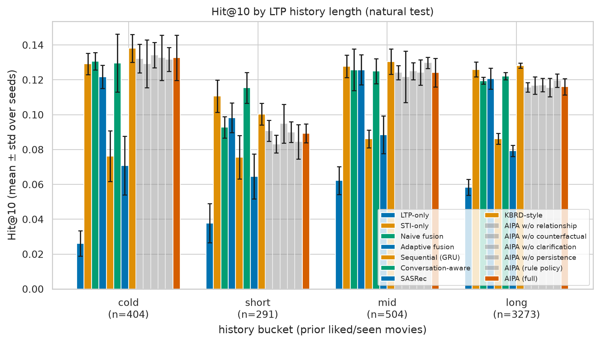
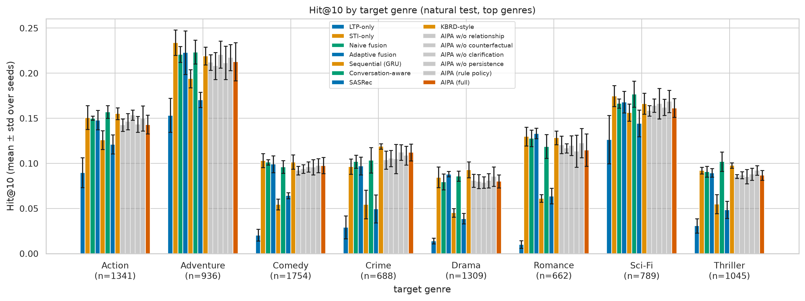

# AIPA-CRS: Experimental Report

_Automatically generated. Run mode: **full**; seeds: [42, 7, 123, 2024, 31337]; generated 2026-09-05 18:01 UTC._

> **Scope statement.** This is a research prototype evaluated on ReDial with derived (weak-rule) and controlled synthetic relationship labels. ReDial carries no native intent/preference relationship annotation; no human-verified labels were available for this run unless stated in Section 2. Counterfactual analyses are model-based interventions and must not be read as causal effects in the population. Approximate baselines are re-implementations, not reproductions of MRGE, DiffLSRec or any other published system; SASRec and KBRD-style are re-implementations on ReDial inputs (KBRD-style without the external knowledge graph), not the original code.

## 1. Research question and hypotheses

**RQ.** Does explicit intent-preference arbitration help specifically when current short-term intent (STI) conflicts with historical long-term preference (LTP)?

* **H1** - AIPA (full) improves ranking quality over the baselines (LTP-only, STI-only, fusion, GRU, conversation-aware, SASRec, KBRD-style) on the overall natural test set.
* **H2** - The gain is concentrated on Conflict/Override instances (natural weak-labelled subset and controlled synthetic subset).
* **H3** - Removing the relationship classifier, the counterfactual diagnostic, clarification or temporal persistence degrades performance.
* **H4** - The relationship classifier recovers reference labels above chance and is reasonably calibrated.

Decision rule: a hypothesis is *supported* when the paired Wilcoxon test (Holm-corrected within a table) on per-instance Hit@10 gives p < 0.05 in the hypothesised direction; *contradicted* when p < 0.05 in the opposite direction; otherwise *not supported*. Where a comparison could not be computed it is reported as NOT RUN. Paired differences are formed per instance *within* each seed and pooled over seeds (n = instances x seeds); a paired t-test and a sign-flip permutation test are reported alongside Wilcoxon, together with Cohen's d and Cliff's delta.

### Success criteria (computed automatically from `outputs/results/success_criteria.csv`)

| id | hypothesis | criterion | value | threshold | met | note |
|---|---|---|---|---|---|---|
| H1 | H1: AIPA (full) beats the best baseline on natural Hit@10 | Hit@10 gain vs KBRD-style > 0 and Holm perm p < 0.05 | -0.0108 | > 0, p < 0.05 | not met | p_holm=0.0065, n=4472 |
| H2-strict | H2: AIPA (full) beats the best baseline on natural conflict (strict) Hit@10 | gain vs KBRD-style > 0 and Holm perm p < 0.05 | -0.0218 | > 0, p < 0.05 | not met | p_holm=0.22, n=331 |
| H2-broad | H2: AIPA (full) beats the best baseline on natural conflict (broad) Hit@10 | gain vs STI-only > 0 and Holm perm p < 0.05 | -0.0160 | > 0, p < 0.05 | not met | p_holm=0.0065, n=1272 |
| H3 | H3: AIPA (full) beats the best baseline on synthetic conflict Hit@10 | gain vs Adaptive fusion > 0 and Holm perm p < 0.05 | -0.0177 | > 0, p < 0.05 | not met | p_holm=1, n=226 (synthetic, reported separately) |
| REL-macroF1 | Relationship classifier (natural, weak-rule reference) | macro-F1 >= 0.5 | 0.6271 | >= 0.5 | met | reference labels are weak-rule labels, not human labels |
| REL-ConflictF1 | Relationship classifier (natural, weak-rule reference) | Conflict-F1 >= 0.5 | 0.4121 | >= 0.5 | not met |  |
| ARB-precision | Arbitration: clarification precision (natural) | >= 0.5 | 0.9912 | >= 0.5 | met |  |
| ARB-unnecessary | Arbitration: unnecessary clarification rate (natural) | <= 0.1 | 0.0017 | <= 0.1 | met |  |
| ABL-relationship | Ablation: removing relationship hurts natural Hit@10 | AIPA (full) - AIPA w/o relationship > 0 and Holm perm p < 0.05 | 0.0002 | > 0, p < 0.05 | not met | p_holm=1 |
| ABL-counterfactual | Ablation: removing counterfactual hurts natural Hit@10 | AIPA (full) - AIPA w/o counterfactual > 0 and Holm perm p < 0.05 | 0.0005 | > 0, p < 0.05 | not met | p_holm=1 |
| ABL-clarification | Ablation: removing clarification hurts natural Hit@10 | AIPA (full) - AIPA w/o clarification > 0 and Holm perm p < 0.05 | -0.0013 | > 0, p < 0.05 | not met | p_holm=1 |
| ABL-persistence | Ablation: removing persistence hurts natural Hit@10 | AIPA (full) - AIPA w/o persistence > 0 and Holm perm p < 0.05 | 0.0003 | > 0, p < 0.05 | not met | p_holm=1 |
| ABL-persistence-affected | Persistence tracker changes Hit@10 on the instances it affected | n > 0, gain > 0 and perm p < 0.05 | 0.0006 | n > 0, p < 0.05 | not met | n_affected=2321, shifts/seed=32.4 |

## 2. Data, labels and preprocessing

Dataset: **ReDial** (English conversational movie recommendation), source `https://github.com/ReDialData/website/raw/data/redial_dataset.zip ; genres: https://files.grouplens.org/datasets/movielens/ml-latest.zip`. Item genres are joined from MovieLens `ml-latest` by normalised title + year (items without a match have empty genre lists).

| statistic | split | seekers | recommenders | dialogues | utterances | movie_mentions | recommender_mentions | unique_movies | genre_coverage | avg_words_per_utterance | avg_turns_per_dialogue |
|---|---|---|---|---|---|---|---|---|---|---|---|
| 0 | train | 643 | 699 | 9006 | 163793 | 47683 | 35669 | 5929 | 0.88 | 6.77 | 18.19 |
| 1 | valid | 272 | 297 | 1000 | 18357 | 5233 | 3884 | 2001 | 0.92 | 6.79 | 18.36 |
| 2 | test | 97 | 128 | 1342 | 23952 | 7154 | 5006 | 2007 | 0.91 | 6.36 | 17.85 |
| 3 | all | 764 | 856 | 11348 | 206102 | 60070 | 44559 | 6636 | 0.87 | 6.73 | 18.16 |

Instances: train=36883, valid=3541, test natural=4472, test synthetic=624. One instance = one new movie recommended by the recommender; LTP uses only the seeker's *earlier* sessions (lower `conversationId`), STI uses only earlier turns of the same session.

**Relationship label sources** (test set):

| relationship_source | relationship_label | count |
|---|---|---|
| synthetic_controlled | Complement | 134 |
| synthetic_controlled | Conflict | 112 |
| synthetic_controlled | Consistent | 123 |
| synthetic_controlled | Override | 114 |
| synthetic_controlled | Uncertain | 141 |
| weak_rule | Complement | 744 |
| weak_rule | Conflict | 292 |
| weak_rule | Consistent | 2070 |
| weak_rule | Override | 39 |
| weak_rule | Uncertain | 1327 |

Human-verified labels: NOT RUN (no data/annotations/human_verified.csv provided).

## 3. Overall performance (natural test instances)

Values are mean ± std over seeds with a 95% bootstrap CI over instances (pooled over seeds) in brackets. Recall@K equals Hit@K because each instance has exactly one target.

| model | n | Hit@10 | NDCG@10 | MRR@10 | Hit@20 | NDCG@20 |
|---|---|---|---|---|---|---|
| LTP-only | 4472 | 0.055 ± 0.003 [0.052, 0.057] | 0.030 ± 0.001 [0.028, 0.032] | 0.023 ± 0.001 [0.021, 0.024] | 0.084 ± 0.003 [0.080, 0.088] | 0.037 ± 0.001 [0.035, 0.039] |
| STI-only | 4472 | 0.125 ± 0.004 [0.121, 0.130] | 0.066 ± 0.002 [0.064, 0.069] | 0.048 ± 0.001 [0.046, 0.051] | 0.196 ± 0.003 [0.191, 0.202] | 0.084 ± 0.002 [0.082, 0.087] |
| Naive fusion | 4472 | 0.119 ± 0.003 [0.115, 0.124] | 0.063 ± 0.001 [0.060, 0.066] | 0.046 ± 0.001 [0.044, 0.048] | 0.191 ± 0.007 [0.185, 0.196] | 0.081 ± 0.003 [0.078, 0.083] |
| Adaptive fusion | 4472 | 0.120 ± 0.005 [0.116, 0.124] | 0.062 ± 0.003 [0.060, 0.065] | 0.045 ± 0.002 [0.043, 0.047] | 0.187 ± 0.006 [0.182, 0.192] | 0.079 ± 0.003 [0.077, 0.082] |
| Sequential (GRU) | 4472 | 0.085 ± 0.004 [0.081, 0.088] | 0.044 ± 0.002 [0.042, 0.046] | 0.032 ± 0.002 [0.030, 0.034] | 0.132 ± 0.005 [0.128, 0.137] | 0.056 ± 0.002 [0.054, 0.058] |
| Conversation-aware | 4472 | 0.123 ± 0.002 [0.118, 0.127] | 0.065 ± 0.001 [0.062, 0.067] | 0.047 ± 0.001 [0.045, 0.050] | 0.189 ± 0.006 [0.184, 0.194] | 0.081 ± 0.002 [0.079, 0.084] |
| SASRec | 4472 | 0.079 ± 0.004 [0.075, 0.082] | 0.038 ± 0.002 [0.037, 0.040] | 0.026 ± 0.001 [0.025, 0.028] | 0.125 ± 0.003 [0.121, 0.129] | 0.050 ± 0.001 [0.048, 0.052] |
| KBRD-style | 4472 | 0.128 ± 0.002 [0.123, 0.132] | 0.067 ± 0.001 [0.064, 0.069] | 0.048 ± 0.001 [0.046, 0.050] | 0.195 ± 0.003 [0.190, 0.200] | 0.083 ± 0.001 [0.081, 0.086] |
| AIPA w/o relationship | 4472 | 0.117 ± 0.002 [0.113, 0.121] | 0.061 ± 0.001 [0.058, 0.063] | 0.044 ± 0.001 [0.042, 0.046] | 0.187 ± 0.005 [0.182, 0.192] | 0.078 ± 0.002 [0.076, 0.081] |
| AIPA w/o counterfactual | 4472 | 0.116 ± 0.004 [0.112, 0.120] | 0.060 ± 0.002 [0.058, 0.063] | 0.044 ± 0.002 [0.042, 0.046] | 0.186 ± 0.003 [0.181, 0.191] | 0.078 ± 0.002 [0.075, 0.081] |
| AIPA w/o clarification | 4472 | 0.118 ± 0.003 [0.114, 0.122] | 0.062 ± 0.002 [0.060, 0.065] | 0.045 ± 0.002 [0.043, 0.047] | 0.184 ± 0.005 [0.179, 0.189] | 0.079 ± 0.002 [0.076, 0.081] |
| AIPA w/o persistence | 4472 | 0.116 ± 0.004 [0.113, 0.120] | 0.060 ± 0.002 [0.058, 0.063] | 0.044 ± 0.001 [0.041, 0.046] | 0.181 ± 0.005 [0.176, 0.186] | 0.076 ± 0.002 [0.074, 0.079] |
| AIPA (rule policy) | 4472 | 0.120 ± 0.004 [0.115, 0.124] | 0.062 ± 0.002 [0.059, 0.064] | 0.045 ± 0.002 [0.042, 0.047] | 0.187 ± 0.006 [0.182, 0.192] | 0.079 ± 0.003 [0.077, 0.082] |
| AIPA (full) | 4472 | 0.117 ± 0.003 [0.113, 0.121] | 0.060 ± 0.001 [0.058, 0.063] | 0.043 ± 0.001 [0.041, 0.045] | 0.180 ± 0.005 [0.175, 0.185] | 0.076 ± 0.002 [0.074, 0.079] |

### Paired significance vs. baselines (natural, Hit@10)

| control | n | n_samples | n_seeds | mean_diff | seed_std_diff | t_p | t_p_holm | wilcoxon_p | wilcoxon_p_holm | perm_p | perm_p_holm | cohen_d | cliffs_delta |
|---|---|---|---|---|---|---|---|---|---|---|---|---|---|
| AIPA (rule policy) | 22360 | 4472 | 5 | -0.0028 | 0.0049 | 0.1285 | 0.7712 | 0.4400 | 1.0000 | 0.1344 | 0.8066 | -0.0102 | -0.0028 |
| AIPA w/o clarification | 22360 | 4472 | 5 | -0.0013 | 0.0027 | 0.4182 | 1.0000 | 0.7221 | 1.0000 | 0.4463 | 1.0000 | -0.0054 | -0.0013 |
| AIPA w/o counterfactual | 22360 | 4472 | 5 | 0.0005 | 0.0046 | 0.7701 | 1.0000 | 0.8813 | 1.0000 | 0.7901 | 1.0000 | 0.0020 | 0.0005 |
| AIPA w/o persistence | 22360 | 4472 | 5 | 0.0003 | 0.0010 | 0.5527 | 1.0000 | 0.9259 | 1.0000 | 0.6107 | 1.0000 | 0.0040 | 0.0003 |
| AIPA w/o relationship | 22360 | 4472 | 5 | 0.0002 | 0.0039 | 0.9214 | 1.0000 | 0.9602 | 1.0000 | 0.9345 | 1.0000 | 0.0007 | 0.0002 |
| Adaptive fusion | 22360 | 4472 | 5 | -0.0032 | 0.0065 | 0.0919 | 0.6436 | 0.3787 | 1.0000 | 0.0865 | 0.6052 | -0.0113 | -0.0032 |
| Conversation-aware | 22360 | 4472 | 5 | -0.0059 | 0.0050 | 0.0033 | 0.0264 | 0.1029 | 0.8234 | 0.0040 | 0.0320 | -0.0197 | -0.0059 |
| KBRD-style | 22360 | 4472 | 5 | -0.0108 | 0.0023 | 0.0000 | 0.0000 | 0.0032 | 0.0321 | 0.0005 | 0.0065 | -0.0350 | -0.0108 |
| LTP-only | 22360 | 4472 | 5 | 0.0623 | 0.0055 | 0.0000 | 0.0000 | 0.0000 | 0.0000 | 0.0005 | 0.0065 | 0.1921 | 0.0623 |
| Naive fusion | 22360 | 4472 | 5 | -0.0027 | 0.0039 | 0.1380 | 0.7712 | 0.4479 | 1.0000 | 0.1384 | 0.8066 | -0.0099 | -0.0027 |
| SASRec | 22360 | 4472 | 5 | 0.0382 | 0.0065 | 0.0000 | 0.0000 | 0.0000 | 0.0000 | 0.0005 | 0.0065 | 0.1144 | 0.0382 |
| STI-only | 22360 | 4472 | 5 | -0.0087 | 0.0059 | 0.0000 | 0.0000 | 0.0158 | 0.1419 | 0.0005 | 0.0065 | -0.0307 | -0.0087 |
| Sequential (GRU) | 22360 | 4472 | 5 | 0.0322 | 0.0052 | 0.0000 | 0.0000 | 0.0000 | 0.0000 | 0.0005 | 0.0065 | 0.1019 | 0.0322 |

## 4. Conflict-sensitive evaluation

Two natural subsets are evaluated: **strict** = weak-rule label in Conflict/Override; **broad** (disagreement) = strict OR (weak-rule confidence >= 0.6 AND Jensen-Shannon divergence between the LTP and STI genre distributions >= 0.5). Both rely on weak-rule labels, not human labels.

| subset | definition | n |
|---|---|---|
| strict | weak-rule label in Conflict/Override | 331 |
| broad | Conflict/Override or (confidence >= 0.6 and JS(ltp, sti) >= 0.5) | 1272 |
| broad_only | broad minus strict | 941 |
| synthetic_conflict | synthetic Conflict/Override | 226 |
| natural | all natural test instances | 4472 |

### 4.1 Natural conflict subsets (weak-rule labels; noisy)

| subset | model | n | Hit@10 | NDCG@10 | MRR@10 | Hit@20 | NDCG@20 |
|---|---|---|---|---|---|---|---|
| strict | LTP-only | 331 | 0.035 ± 0.003 [0.027, 0.044] | 0.018 ± 0.002 [0.013, 0.024] | 0.013 ± 0.002 [0.009, 0.018] | 0.057 ± 0.006 [0.046, 0.068] | 0.024 ± 0.002 [0.019, 0.029] |
| strict | STI-only | 331 | 0.169 ± 0.003 [0.152, 0.187] | 0.088 ± 0.004 [0.078, 0.098] | 0.064 ± 0.005 [0.055, 0.073] | 0.260 ± 0.008 [0.240, 0.280] | 0.111 ± 0.004 [0.101, 0.122] |
| strict | Naive fusion | 331 | 0.148 ± 0.004 [0.132, 0.165] | 0.077 ± 0.006 [0.068, 0.088] | 0.056 ± 0.008 [0.047, 0.065] | 0.246 ± 0.019 [0.227, 0.267] | 0.102 ± 0.010 [0.092, 0.112] |
| strict | Adaptive fusion | 331 | 0.162 ± 0.008 [0.144, 0.180] | 0.082 ± 0.004 [0.072, 0.093] | 0.058 ± 0.005 [0.050, 0.067] | 0.253 ± 0.012 [0.234, 0.273] | 0.105 ± 0.006 [0.095, 0.115] |
| strict | Sequential (GRU) | 331 | 0.085 ± 0.005 [0.071, 0.099] | 0.044 ± 0.004 [0.037, 0.053] | 0.032 ± 0.004 [0.026, 0.040] | 0.132 ± 0.011 [0.116, 0.148] | 0.056 ± 0.005 [0.048, 0.065] |
| strict | Conversation-aware | 331 | 0.162 ± 0.007 [0.143, 0.179] | 0.081 ± 0.005 [0.071, 0.091] | 0.057 ± 0.004 [0.049, 0.066] | 0.240 ± 0.019 [0.221, 0.261] | 0.101 ± 0.006 [0.092, 0.111] |
| strict | SASRec | 331 | 0.071 ± 0.010 [0.059, 0.083] | 0.033 ± 0.005 [0.027, 0.040] | 0.022 ± 0.003 [0.017, 0.028] | 0.110 ± 0.007 [0.095, 0.124] | 0.043 ± 0.003 [0.036, 0.050] |
| strict | KBRD-style | 331 | 0.172 ± 0.005 [0.152, 0.190] | 0.091 ± 0.003 [0.080, 0.102] | 0.067 ± 0.005 [0.057, 0.077] | 0.265 ± 0.008 [0.244, 0.285] | 0.115 ± 0.004 [0.104, 0.126] |
| strict | AIPA w/o relationship | 331 | 0.153 ± 0.012 [0.136, 0.169] | 0.075 ± 0.003 [0.065, 0.083] | 0.051 ± 0.002 [0.044, 0.059] | 0.236 ± 0.021 [0.218, 0.256] | 0.096 ± 0.006 [0.086, 0.105] |
| strict | AIPA w/o counterfactual | 331 | 0.153 ± 0.006 [0.137, 0.169] | 0.075 ± 0.004 [0.066, 0.084] | 0.052 ± 0.004 [0.044, 0.059] | 0.239 ± 0.020 [0.220, 0.260] | 0.097 ± 0.006 [0.088, 0.106] |
| strict | AIPA w/o clarification | 331 | 0.147 ± 0.007 [0.130, 0.163] | 0.074 ± 0.004 [0.065, 0.084] | 0.053 ± 0.005 [0.044, 0.061] | 0.233 ± 0.016 [0.213, 0.253] | 0.096 ± 0.004 [0.086, 0.106] |
| strict | AIPA w/o persistence | 331 | 0.144 ± 0.012 [0.129, 0.161] | 0.073 ± 0.004 [0.063, 0.082] | 0.051 ± 0.002 [0.043, 0.059] | 0.234 ± 0.017 [0.215, 0.255] | 0.095 ± 0.005 [0.086, 0.105] |
| strict | AIPA (rule policy) | 331 | 0.144 ± 0.016 [0.127, 0.160] | 0.070 ± 0.006 [0.061, 0.079] | 0.048 ± 0.005 [0.040, 0.055] | 0.225 ± 0.015 [0.205, 0.244] | 0.090 ± 0.006 [0.081, 0.099] |
| strict | AIPA (full) | 331 | 0.150 ± 0.011 [0.134, 0.166] | 0.075 ± 0.004 [0.066, 0.084] | 0.053 ± 0.003 [0.045, 0.061] | 0.232 ± 0.015 [0.213, 0.253] | 0.095 ± 0.004 [0.086, 0.105] |
| broad | LTP-only | 1272 | 0.041 ± 0.004 [0.037, 0.046] | 0.020 ± 0.002 [0.018, 0.023] | 0.014 ± 0.001 [0.012, 0.016] | 0.067 ± 0.004 [0.061, 0.073] | 0.027 ± 0.002 [0.024, 0.030] |
| broad | STI-only | 1272 | 0.164 ± 0.007 [0.155, 0.173] | 0.083 ± 0.003 [0.078, 0.088] | 0.059 ± 0.003 [0.054, 0.063] | 0.251 ± 0.002 [0.240, 0.261] | 0.105 ± 0.003 [0.100, 0.110] |
| broad | Naive fusion | 1272 | 0.149 ± 0.002 [0.139, 0.157] | 0.076 ± 0.002 [0.071, 0.081] | 0.054 ± 0.003 [0.050, 0.059] | 0.237 ± 0.008 [0.227, 0.247] | 0.098 ± 0.004 [0.093, 0.104] |
| broad | Adaptive fusion | 1272 | 0.154 ± 0.005 [0.145, 0.162] | 0.076 ± 0.001 [0.071, 0.081] | 0.053 ± 0.001 [0.049, 0.057] | 0.236 ± 0.004 [0.225, 0.245] | 0.097 ± 0.002 [0.092, 0.102] |
| broad | Sequential (GRU) | 1272 | 0.081 ± 0.005 [0.075, 0.089] | 0.041 ± 0.002 [0.038, 0.045] | 0.029 ± 0.002 [0.026, 0.033] | 0.130 ± 0.009 [0.122, 0.139] | 0.054 ± 0.003 [0.050, 0.057] |
| broad | Conversation-aware | 1272 | 0.152 ± 0.001 [0.144, 0.161] | 0.077 ± 0.002 [0.072, 0.082] | 0.055 ± 0.002 [0.050, 0.059] | 0.228 ± 0.009 [0.218, 0.238] | 0.097 ± 0.002 [0.091, 0.101] |
| broad | SASRec | 1272 | 0.073 ± 0.009 [0.067, 0.080] | 0.035 ± 0.004 [0.032, 0.038] | 0.024 ± 0.003 [0.021, 0.026] | 0.117 ± 0.005 [0.109, 0.125] | 0.046 ± 0.003 [0.043, 0.050] |
| broad | KBRD-style | 1272 | 0.163 ± 0.004 [0.154, 0.172] | 0.085 ± 0.002 [0.079, 0.090] | 0.061 ± 0.002 [0.056, 0.066] | 0.247 ± 0.004 [0.236, 0.257] | 0.105 ± 0.002 [0.100, 0.111] |
| broad | AIPA w/o relationship | 1272 | 0.145 ± 0.010 [0.137, 0.154] | 0.073 ± 0.005 [0.068, 0.078] | 0.051 ± 0.004 [0.047, 0.055] | 0.229 ± 0.010 [0.219, 0.240] | 0.094 ± 0.005 [0.089, 0.099] |
| broad | AIPA w/o counterfactual | 1272 | 0.146 ± 0.007 [0.138, 0.154] | 0.074 ± 0.005 [0.069, 0.079] | 0.053 ± 0.005 [0.048, 0.057] | 0.228 ± 0.007 [0.218, 0.238] | 0.095 ± 0.005 [0.090, 0.100] |
| broad | AIPA w/o clarification | 1272 | 0.147 ± 0.007 [0.138, 0.155] | 0.075 ± 0.004 [0.070, 0.079] | 0.053 ± 0.003 [0.049, 0.057] | 0.226 ± 0.004 [0.216, 0.236] | 0.095 ± 0.003 [0.090, 0.100] |
| broad | AIPA w/o persistence | 1272 | 0.147 ± 0.008 [0.139, 0.156] | 0.073 ± 0.005 [0.069, 0.078] | 0.051 ± 0.004 [0.048, 0.055] | 0.224 ± 0.005 [0.213, 0.233] | 0.093 ± 0.004 [0.088, 0.097] |
| broad | AIPA (rule policy) | 1272 | 0.150 ± 0.005 [0.142, 0.160] | 0.075 ± 0.002 [0.070, 0.080] | 0.053 ± 0.002 [0.049, 0.057] | 0.232 ± 0.006 [0.220, 0.242] | 0.096 ± 0.003 [0.091, 0.101] |
| broad | AIPA (full) | 1272 | 0.148 ± 0.007 [0.140, 0.156] | 0.073 ± 0.004 [0.069, 0.078] | 0.051 ± 0.004 [0.047, 0.055] | 0.223 ± 0.005 [0.213, 0.233] | 0.092 ± 0.003 [0.087, 0.097] |

### 4.2 Natural non-disagreement subset (complement of the broad subset)

| model | n | Hit@10 | NDCG@10 | MRR@10 | Hit@20 | NDCG@20 |
|---|---|---|---|---|---|---|
| LTP-only | 3200 | 0.060 ± 0.004 [0.056, 0.063] | 0.034 ± 0.002 [0.032, 0.036] | 0.026 ± 0.001 [0.024, 0.028] | 0.091 ± 0.003 [0.086, 0.095] | 0.042 ± 0.002 [0.039, 0.044] |
| STI-only | 3200 | 0.110 ± 0.003 [0.105, 0.115] | 0.059 ± 0.002 [0.056, 0.062] | 0.044 ± 0.001 [0.041, 0.047] | 0.175 ± 0.005 [0.169, 0.180] | 0.076 ± 0.002 [0.073, 0.078] |
| Naive fusion | 3200 | 0.108 ± 0.004 [0.103, 0.113] | 0.058 ± 0.001 [0.055, 0.061] | 0.043 ± 0.001 [0.040, 0.045] | 0.172 ± 0.008 [0.166, 0.178] | 0.074 ± 0.002 [0.071, 0.077] |
| Adaptive fusion | 3200 | 0.106 ± 0.005 [0.102, 0.111] | 0.057 ± 0.004 [0.054, 0.059] | 0.042 ± 0.004 [0.039, 0.044] | 0.168 ± 0.010 [0.162, 0.173] | 0.072 ± 0.005 [0.069, 0.075] |
| Sequential (GRU) | 3200 | 0.086 ± 0.005 [0.082, 0.090] | 0.045 ± 0.003 [0.043, 0.048] | 0.033 ± 0.002 [0.031, 0.035] | 0.133 ± 0.004 [0.128, 0.138] | 0.057 ± 0.002 [0.055, 0.060] |
| Conversation-aware | 3200 | 0.111 ± 0.003 [0.106, 0.115] | 0.060 ± 0.002 [0.057, 0.063] | 0.044 ± 0.002 [0.042, 0.047] | 0.173 ± 0.005 [0.168, 0.178] | 0.075 ± 0.002 [0.072, 0.078] |
| SASRec | 3200 | 0.081 ± 0.004 [0.077, 0.085] | 0.040 ± 0.002 [0.037, 0.042] | 0.027 ± 0.001 [0.025, 0.029] | 0.128 ± 0.005 [0.123, 0.132] | 0.052 ± 0.001 [0.049, 0.054] |
| KBRD-style | 3200 | 0.113 ± 0.002 [0.109, 0.118] | 0.059 ± 0.001 [0.057, 0.062] | 0.043 ± 0.001 [0.041, 0.045] | 0.174 ± 0.003 [0.168, 0.180] | 0.075 ± 0.001 [0.072, 0.078] |
| AIPA w/o relationship | 3200 | 0.105 ± 0.003 [0.101, 0.110] | 0.056 ± 0.002 [0.053, 0.059] | 0.041 ± 0.002 [0.039, 0.044] | 0.171 ± 0.004 [0.165, 0.177] | 0.072 ± 0.002 [0.069, 0.075] |
| AIPA w/o counterfactual | 3200 | 0.104 ± 0.005 [0.100, 0.109] | 0.055 ± 0.003 [0.052, 0.058] | 0.040 ± 0.002 [0.038, 0.043] | 0.169 ± 0.003 [0.163, 0.174] | 0.071 ± 0.003 [0.068, 0.074] |
| AIPA w/o clarification | 3200 | 0.107 ± 0.002 [0.102, 0.111] | 0.057 ± 0.001 [0.054, 0.060] | 0.042 ± 0.001 [0.040, 0.045] | 0.167 ± 0.006 [0.162, 0.173] | 0.072 ± 0.002 [0.069, 0.075] |
| AIPA w/o persistence | 3200 | 0.104 ± 0.003 [0.100, 0.109] | 0.055 ± 0.001 [0.052, 0.058] | 0.040 ± 0.001 [0.038, 0.043] | 0.163 ± 0.007 [0.158, 0.169] | 0.070 ± 0.002 [0.067, 0.073] |
| AIPA (rule policy) | 3200 | 0.107 ± 0.004 [0.103, 0.112] | 0.057 ± 0.002 [0.054, 0.059] | 0.041 ± 0.002 [0.039, 0.044] | 0.169 ± 0.006 [0.164, 0.175] | 0.072 ± 0.003 [0.069, 0.075] |
| AIPA (full) | 3200 | 0.104 ± 0.003 [0.100, 0.109] | 0.055 ± 0.001 [0.053, 0.058] | 0.041 ± 0.001 [0.038, 0.043] | 0.163 ± 0.007 [0.157, 0.168] | 0.070 ± 0.002 [0.067, 0.073] |

### 4.3 Controlled synthetic Conflict/Override subset

Targets on this subset are *sampled* items that match the injected intent; the numbers measure whether a system follows a clearly expressed short-term intent, not accuracy on human recommendations.

| model | n | Hit@10 | NDCG@10 | MRR@10 | Hit@20 | NDCG@20 |
|---|---|---|---|---|---|---|
| LTP-only | 226 | 0.027 ± 0.009 [0.019, 0.036] | 0.010 ± 0.003 [0.007, 0.013] | 0.005 ± 0.002 [0.003, 0.006] | 0.055 ± 0.009 [0.042, 0.068] | 0.017 ± 0.002 [0.013, 0.021] |
| STI-only | 226 | 0.238 ± 0.012 [0.215, 0.263] | 0.124 ± 0.007 [0.111, 0.139] | 0.090 ± 0.006 [0.079, 0.103] | 0.377 ± 0.017 [0.350, 0.406] | 0.160 ± 0.007 [0.147, 0.174] |
| Naive fusion | 226 | 0.237 ± 0.024 [0.213, 0.263] | 0.122 ± 0.011 [0.108, 0.138] | 0.087 ± 0.007 [0.075, 0.100] | 0.382 ± 0.022 [0.355, 0.411] | 0.158 ± 0.010 [0.145, 0.173] |
| Adaptive fusion | 226 | 0.265 ± 0.013 [0.239, 0.292] | 0.135 ± 0.012 [0.120, 0.150] | 0.095 ± 0.015 [0.083, 0.109] | 0.404 ± 0.019 [0.376, 0.435] | 0.170 ± 0.015 [0.155, 0.185] |
| Sequential (GRU) | 226 | 0.017 ± 0.006 [0.010, 0.025] | 0.006 ± 0.002 [0.003, 0.009] | 0.003 ± 0.001 [0.002, 0.004] | 0.035 ± 0.009 [0.025, 0.046] | 0.010 ± 0.003 [0.007, 0.014] |
| Conversation-aware | 226 | 0.227 ± 0.013 [0.204, 0.252] | 0.124 ± 0.011 [0.109, 0.140] | 0.093 ± 0.011 [0.079, 0.106] | 0.343 ± 0.028 [0.314, 0.372] | 0.153 ± 0.015 [0.137, 0.168] |
| SASRec | 226 | 0.007 ± 0.005 [0.003, 0.012] | 0.002 ± 0.002 [0.001, 0.004] | 0.001 ± 0.001 [0.000, 0.002] | 0.016 ± 0.010 [0.009, 0.023] | 0.005 ± 0.003 [0.003, 0.007] |
| KBRD-style | 226 | 0.258 ± 0.018 [0.233, 0.283] | 0.140 ± 0.005 [0.125, 0.155] | 0.104 ± 0.002 [0.091, 0.118] | 0.384 ± 0.011 [0.356, 0.413] | 0.172 ± 0.004 [0.157, 0.187] |
| AIPA w/o relationship | 226 | 0.243 ± 0.015 [0.219, 0.269] | 0.128 ± 0.011 [0.113, 0.142] | 0.093 ± 0.010 [0.080, 0.106] | 0.381 ± 0.009 [0.355, 0.411] | 0.162 ± 0.008 [0.148, 0.177] |
| AIPA w/o counterfactual | 226 | 0.242 ± 0.021 [0.217, 0.269] | 0.124 ± 0.016 [0.110, 0.139] | 0.088 ± 0.016 [0.076, 0.101] | 0.352 ± 0.035 [0.324, 0.381] | 0.151 ± 0.020 [0.137, 0.166] |
| AIPA w/o clarification | 226 | 0.243 ± 0.024 [0.219, 0.269] | 0.123 ± 0.012 [0.110, 0.138] | 0.088 ± 0.011 [0.075, 0.101] | 0.394 ± 0.020 [0.366, 0.423] | 0.161 ± 0.012 [0.147, 0.176] |
| AIPA w/o persistence | 226 | 0.247 ± 0.022 [0.219, 0.272] | 0.123 ± 0.013 [0.109, 0.137] | 0.086 ± 0.012 [0.074, 0.098] | 0.382 ± 0.022 [0.354, 0.412] | 0.157 ± 0.013 [0.143, 0.171] |
| AIPA (rule policy) | 226 | 0.233 ± 0.015 [0.209, 0.258] | 0.125 ± 0.008 [0.110, 0.140] | 0.092 ± 0.006 [0.079, 0.105] | 0.379 ± 0.021 [0.352, 0.407] | 0.161 ± 0.008 [0.147, 0.176] |
| AIPA (full) | 226 | 0.247 ± 0.022 [0.219, 0.272] | 0.123 ± 0.013 [0.109, 0.137] | 0.086 ± 0.012 [0.074, 0.098] | 0.382 ± 0.022 [0.354, 0.412] | 0.157 ± 0.013 [0.143, 0.171] |

### 4.4 Synthetic conflict subset by injection intensity (mean ± std over seeds)

| intensity | model | n | seeds | Hit@10_mean | Hit@10_std | NDCG@10_mean | NDCG@10_std |
|---|---|---|---|---|---|---|---|
| 1 | LTP-only | 85 | 5 | 0.033 | 0.014 | 0.011 | 0.004 |
| 1 | STI-only | 85 | 5 | 0.242 | 0.032 | 0.136 | 0.015 |
| 1 | Naive fusion | 85 | 5 | 0.242 | 0.023 | 0.135 | 0.013 |
| 1 | Adaptive fusion | 85 | 5 | 0.285 | 0.044 | 0.153 | 0.034 |
| 1 | Sequential (GRU) | 85 | 5 | 0.021 | 0.014 | 0.008 | 0.005 |
| 1 | Conversation-aware | 85 | 5 | 0.224 | 0.032 | 0.130 | 0.024 |
| 1 | SASRec | 85 | 5 | 0.009 | 0.009 | 0.003 | 0.003 |
| 1 | KBRD-style | 85 | 5 | 0.271 | 0.027 | 0.152 | 0.012 |
| 1 | AIPA w/o relationship | 85 | 5 | 0.264 | 0.028 | 0.149 | 0.013 |
| 1 | AIPA w/o counterfactual | 85 | 5 | 0.261 | 0.026 | 0.139 | 0.025 |
| 1 | AIPA w/o clarification | 85 | 5 | 0.247 | 0.025 | 0.133 | 0.020 |
| 1 | AIPA w/o persistence | 85 | 5 | 0.233 | 0.034 | 0.124 | 0.026 |
| 1 | AIPA (rule policy) | 85 | 5 | 0.235 | 0.015 | 0.137 | 0.012 |
| 1 | AIPA (full) | 85 | 5 | 0.233 | 0.034 | 0.124 | 0.026 |
| 2 | LTP-only | 68 | 5 | 0.035 | 0.024 | 0.012 | 0.009 |
| 2 | STI-only | 68 | 5 | 0.303 | 0.026 | 0.159 | 0.026 |
| 2 | Naive fusion | 68 | 5 | 0.271 | 0.022 | 0.144 | 0.023 |
| 2 | Adaptive fusion | 68 | 5 | 0.309 | 0.045 | 0.161 | 0.030 |
| 2 | Sequential (GRU) | 68 | 5 | 0.026 | 0.011 | 0.009 | 0.004 |
| 2 | Conversation-aware | 68 | 5 | 0.315 | 0.027 | 0.173 | 0.025 |
| 2 | SASRec | 68 | 5 | 0.012 | 0.017 | 0.004 | 0.006 |
| 2 | KBRD-style | 68 | 5 | 0.309 | 0.023 | 0.176 | 0.011 |
| 2 | AIPA w/o relationship | 68 | 5 | 0.315 | 0.015 | 0.163 | 0.014 |
| 2 | AIPA w/o counterfactual | 68 | 5 | 0.303 | 0.033 | 0.155 | 0.017 |
| 2 | AIPA w/o clarification | 68 | 5 | 0.326 | 0.056 | 0.166 | 0.024 |
| 2 | AIPA w/o persistence | 68 | 5 | 0.312 | 0.058 | 0.161 | 0.026 |
| 2 | AIPA (rule policy) | 68 | 5 | 0.297 | 0.031 | 0.161 | 0.018 |
| 2 | AIPA (full) | 68 | 5 | 0.312 | 0.058 | 0.161 | 0.026 |
| 3 | LTP-only | 73 | 5 | 0.014 | 0.009 | 0.005 | 0.003 |
| 3 | STI-only | 73 | 5 | 0.173 | 0.021 | 0.078 | 0.004 |
| 3 | Naive fusion | 73 | 5 | 0.200 | 0.044 | 0.086 | 0.016 |
| 3 | Adaptive fusion | 73 | 5 | 0.200 | 0.040 | 0.089 | 0.012 |
| 3 | Sequential (GRU) | 73 | 5 | 0.003 | 0.005 | 0.001 | 0.002 |
| 3 | Conversation-aware | 73 | 5 | 0.151 | 0.009 | 0.070 | 0.008 |
| 3 | SASRec | 73 | 5 | 0.000 | 0.000 | 0.000 | 0.000 |
| 3 | KBRD-style | 73 | 5 | 0.197 | 0.022 | 0.093 | 0.012 |
| 3 | AIPA w/o relationship | 73 | 5 | 0.153 | 0.022 | 0.070 | 0.017 |
| 3 | AIPA w/o counterfactual | 73 | 5 | 0.164 | 0.025 | 0.078 | 0.019 |
| 3 | AIPA w/o clarification | 73 | 5 | 0.162 | 0.027 | 0.072 | 0.013 |
| 3 | AIPA w/o persistence | 73 | 5 | 0.203 | 0.029 | 0.086 | 0.010 |
| 3 | AIPA (rule policy) | 73 | 5 | 0.170 | 0.035 | 0.077 | 0.018 |
| 3 | AIPA (full) | 73 | 5 | 0.203 | 0.029 | 0.086 | 0.010 |

### 4.5 Paired significance on conflict subsets (Hit@10)

| subset | control | n | n_samples | n_seeds | mean_diff | seed_std_diff | t_p | t_p_holm | wilcoxon_p | wilcoxon_p_holm | perm_p | perm_p_holm | cohen_d | cliffs_delta |
|---|---|---|---|---|---|---|---|---|---|---|---|---|---|---|
| conflict_natural_strict | AIPA (rule policy) | 1655 | 331 | 5 | 0.0060 | 0.0171 | 0.4205 | 1.0000 | 0.6527 | 1.0000 | 0.4938 | 1.0000 | 0.0198 | 0.0060 |
| conflict_natural_strict | AIPA w/o clarification | 1655 | 331 | 5 | 0.0030 | 0.0136 | 0.6549 | 1.0000 | 0.8192 | 1.0000 | 0.7446 | 1.0000 | 0.0110 | 0.0030 |
| conflict_natural_strict | AIPA w/o counterfactual | 1655 | 331 | 5 | -0.0030 | 0.0138 | 0.7023 | 1.0000 | 0.8236 | 1.0000 | 0.7746 | 1.0000 | -0.0094 | -0.0030 |
| conflict_natural_strict | AIPA w/o persistence | 1655 | 331 | 5 | 0.0054 | 0.0048 | 0.0290 | 0.2320 | 0.6615 | 1.0000 | 0.0470 | 0.3758 | 0.0537 | 0.0054 |
| conflict_natural_strict | AIPA w/o relationship | 1655 | 331 | 5 | -0.0030 | 0.0194 | 0.7023 | 1.0000 | 0.8236 | 1.0000 | 0.7541 | 1.0000 | -0.0094 | -0.0030 |
| conflict_natural_strict | Adaptive fusion | 1655 | 331 | 5 | -0.0121 | 0.0159 | 0.1426 | 0.9980 | 0.3763 | 1.0000 | 0.1799 | 1.0000 | -0.0361 | -0.0121 |
| conflict_natural_strict | Conversation-aware | 1655 | 331 | 5 | -0.0121 | 0.0176 | 0.1696 | 1.0000 | 0.3829 | 1.0000 | 0.1874 | 1.0000 | -0.0338 | -0.0121 |
| conflict_natural_strict | KBRD-style | 1655 | 331 | 5 | -0.0218 | 0.0070 | 0.0161 | 0.1611 | 0.1185 | 1.0000 | 0.0220 | 0.2199 | -0.0592 | -0.0218 |
| conflict_natural_strict | LTP-only | 1655 | 331 | 5 | 0.1148 | 0.0099 | 0.0000 | 0.0000 | 0.0000 | 0.0000 | 0.0005 | 0.0065 | 0.3146 | 0.1148 |
| conflict_natural_strict | Naive fusion | 1655 | 331 | 5 | 0.0018 | 0.0112 | 0.8072 | 1.0000 | 0.8924 | 1.0000 | 0.8671 | 1.0000 | 0.0060 | 0.0018 |
| conflict_natural_strict | SASRec | 1655 | 331 | 5 | 0.0792 | 0.0168 | 0.0000 | 0.0000 | 0.0000 | 0.0000 | 0.0005 | 0.0065 | 0.2157 | 0.0792 |
| conflict_natural_strict | STI-only | 1655 | 331 | 5 | -0.0193 | 0.0111 | 0.0170 | 0.1611 | 0.1556 | 1.0000 | 0.0245 | 0.2204 | -0.0587 | -0.0193 |
| conflict_natural_strict | Sequential (GRU) | 1655 | 331 | 5 | 0.0647 | 0.0126 | 0.0000 | 0.0000 | 0.0000 | 0.0000 | 0.0005 | 0.0065 | 0.1772 | 0.0647 |
| conflict_natural_broad | AIPA (rule policy) | 6360 | 1272 | 5 | -0.0025 | 0.0111 | 0.5108 | 1.0000 | 0.7133 | 1.0000 | 0.5397 | 1.0000 | -0.0082 | -0.0025 |
| conflict_natural_broad | AIPA w/o clarification | 6360 | 1272 | 5 | 0.0009 | 0.0062 | 0.7739 | 1.0000 | 0.8880 | 1.0000 | 0.8171 | 1.0000 | 0.0036 | 0.0009 |
| conflict_natural_broad | AIPA w/o counterfactual | 6360 | 1272 | 5 | 0.0020 | 0.0101 | 0.5966 | 1.0000 | 0.7657 | 1.0000 | 0.6392 | 1.0000 | 0.0066 | 0.0020 |
| conflict_natural_broad | AIPA w/o persistence | 6360 | 1272 | 5 | 0.0006 | 0.0034 | 0.6115 | 1.0000 | 0.9209 | 1.0000 | 0.6927 | 1.0000 | 0.0064 | 0.0006 |
| conflict_natural_broad | AIPA w/o relationship | 6360 | 1272 | 5 | 0.0025 | 0.0109 | 0.5087 | 1.0000 | 0.7131 | 1.0000 | 0.5387 | 1.0000 | 0.0083 | 0.0025 |
| conflict_natural_broad | Adaptive fusion | 6360 | 1272 | 5 | -0.0060 | 0.0095 | 0.1307 | 1.0000 | 0.3856 | 1.0000 | 0.1359 | 1.0000 | -0.0190 | -0.0060 |
| conflict_natural_broad | Conversation-aware | 6360 | 1272 | 5 | -0.0042 | 0.0071 | 0.3213 | 1.0000 | 0.5437 | 1.0000 | 0.3548 | 1.0000 | -0.0124 | -0.0042 |
| conflict_natural_broad | KBRD-style | 6360 | 1272 | 5 | -0.0154 | 0.0074 | 0.0004 | 0.0038 | 0.0283 | 0.2543 | 0.0015 | 0.0135 | -0.0442 | -0.0154 |
| conflict_natural_broad | LTP-only | 6360 | 1272 | 5 | 0.1066 | 0.0056 | 0.0000 | 0.0000 | 0.0000 | 0.0000 | 0.0005 | 0.0065 | 0.2955 | 0.1066 |
| conflict_natural_broad | Naive fusion | 6360 | 1272 | 5 | -0.0008 | 0.0083 | 0.8362 | 1.0000 | 0.9085 | 1.0000 | 0.8551 | 1.0000 | -0.0026 | -0.0008 |
| conflict_natural_broad | SASRec | 6360 | 1272 | 5 | 0.0747 | 0.0111 | 0.0000 | 0.0000 | 0.0000 | 0.0000 | 0.0005 | 0.0065 | 0.2041 | 0.0747 |
| conflict_natural_broad | STI-only | 6360 | 1272 | 5 | -0.0160 | 0.0131 | 0.0001 | 0.0010 | 0.0209 | 0.2085 | 0.0005 | 0.0065 | -0.0488 | -0.0160 |
| conflict_natural_broad | Sequential (GRU) | 6360 | 1272 | 5 | 0.0665 | 0.0089 | 0.0000 | 0.0000 | 0.0000 | 0.0000 | 0.0005 | 0.0065 | 0.1898 | 0.0665 |
| conflict_synthetic | AIPA (rule policy) | 1130 | 226 | 5 | 0.0142 | 0.0238 | 0.2306 | 1.0000 | 0.4101 | 1.0000 | 0.2584 | 1.0000 | 0.0357 | 0.0142 |
| conflict_synthetic | AIPA w/o clarification | 1130 | 226 | 5 | 0.0035 | 0.0110 | 0.7105 | 1.0000 | 0.8290 | 1.0000 | 0.7781 | 1.0000 | 0.0110 | 0.0035 |
| conflict_synthetic | AIPA w/o counterfactual | 1130 | 226 | 5 | 0.0044 | 0.0322 | 0.7088 | 1.0000 | 0.7970 | 1.0000 | 0.7566 | 1.0000 | 0.0111 | 0.0044 |
| conflict_synthetic | AIPA w/o persistence | 1130 | 226 | 5 | 0.0000 | 0.0000 | n/a | n/a | n/a | n/a | n/a | n/a | n/a | n/a |
| conflict_synthetic | AIPA w/o relationship | 1130 | 226 | 5 | 0.0035 | 0.0306 | 0.7619 | 1.0000 | 0.8364 | 1.0000 | 0.8066 | 1.0000 | 0.0090 | 0.0035 |
| conflict_synthetic | Adaptive fusion | 1130 | 226 | 5 | -0.0177 | 0.0325 | 0.1383 | 1.0000 | 0.3046 | 1.0000 | 0.1489 | 1.0000 | -0.0441 | -0.0177 |
| conflict_synthetic | Conversation-aware | 1130 | 226 | 5 | 0.0195 | 0.0227 | 0.1124 | 1.0000 | 0.2623 | 1.0000 | 0.1154 | 1.0000 | 0.0473 | 0.0195 |
| conflict_synthetic | KBRD-style | 1130 | 226 | 5 | -0.0115 | 0.0214 | 0.3618 | 1.0000 | 0.5112 | 1.0000 | 0.3973 | 1.0000 | -0.0271 | -0.0115 |
| conflict_synthetic | LTP-only | 1130 | 226 | 5 | 0.2195 | 0.0191 | 0.0000 | 0.0000 | 0.0000 | 0.0000 | 0.0005 | 0.0065 | 0.5118 | 0.2195 |
| conflict_synthetic | Naive fusion | 1130 | 226 | 5 | 0.0097 | 0.0409 | 0.4005 | 1.0000 | 0.5692 | 1.0000 | 0.4433 | 1.0000 | 0.0250 | 0.0097 |
| conflict_synthetic | SASRec | 1130 | 226 | 5 | 0.2398 | 0.0236 | 0.0000 | 0.0000 | 0.0000 | 0.0000 | 0.0005 | 0.0065 | 0.5534 | 0.2398 |
| conflict_synthetic | STI-only | 1130 | 226 | 5 | 0.0088 | 0.0181 | 0.4433 | 1.0000 | 0.6045 | 1.0000 | 0.4823 | 1.0000 | 0.0228 | 0.0088 |
| conflict_synthetic | Sequential (GRU) | 1130 | 226 | 5 | 0.2301 | 0.0224 | 0.0000 | 0.0000 | 0.0000 | 0.0000 | 0.0005 | 0.0065 | 0.5308 | 0.2301 |

## 5. Relationship classification, arbitration and clarification

| model | subset | accuracy | macro_precision | macro_recall | macro_f1 | weighted_f1 | F1_Complement | F1_Consistent | F1_Conflict | F1_Override | F1_Uncertain |
|---|---|---|---|---|---|---|---|---|---|---|---|
| AIPA (full) | all | 0.820 | 0.784 | 0.752 | 0.764 | 0.819 | 0.610 | 0.854 | 0.568 | 0.831 | 0.958 |
| AIPA (full) | natural | 0.800 | 0.648 | 0.619 | 0.627 | 0.797 | 0.553 | 0.848 | 0.412 | 0.369 | 0.954 |
| AIPA (full) | synthetic | 0.963 | 0.965 | 0.961 | 0.962 | 0.962 | 0.927 | 0.961 | 0.931 | 0.988 | 1.000 |
| AIPA (rule policy) | all | 0.822 | 0.772 | 0.761 | 0.764 | 0.819 | 0.606 | 0.858 | 0.570 | 0.827 | 0.957 |
| AIPA (rule policy) | natural | 0.802 | 0.641 | 0.641 | 0.636 | 0.799 | 0.543 | 0.852 | 0.427 | 0.406 | 0.953 |
| AIPA (rule policy) | synthetic | 0.967 | 0.969 | 0.965 | 0.966 | 0.967 | 0.936 | 0.968 | 0.930 | 0.996 | 1.000 |
| AIPA w/o clarification | all | 0.821 | 0.788 | 0.748 | 0.763 | 0.818 | 0.611 | 0.854 | 0.557 | 0.835 | 0.960 |
| AIPA w/o clarification | natural | 0.801 | 0.644 | 0.605 | 0.617 | 0.796 | 0.549 | 0.847 | 0.400 | 0.334 | 0.956 |
| AIPA w/o clarification | synthetic | 0.965 | 0.968 | 0.963 | 0.964 | 0.965 | 0.934 | 0.968 | 0.929 | 0.992 | 1.000 |
| AIPA w/o counterfactual | all | 0.817 | 0.770 | 0.755 | 0.760 | 0.815 | 0.600 | 0.853 | 0.560 | 0.830 | 0.956 |
| AIPA w/o counterfactual | natural | 0.795 | 0.630 | 0.621 | 0.621 | 0.792 | 0.534 | 0.847 | 0.406 | 0.368 | 0.951 |
| AIPA w/o counterfactual | synthetic | 0.973 | 0.975 | 0.972 | 0.973 | 0.973 | 0.947 | 0.970 | 0.951 | 0.997 | 1.000 |
| AIPA w/o persistence | all | 0.826 | 0.790 | 0.765 | 0.774 | 0.824 | 0.615 | 0.860 | 0.586 | 0.851 | 0.959 |
| AIPA w/o persistence | natural | 0.807 | 0.672 | 0.652 | 0.656 | 0.804 | 0.556 | 0.854 | 0.444 | 0.471 | 0.954 |
| AIPA w/o persistence | synthetic | 0.963 | 0.965 | 0.961 | 0.962 | 0.962 | 0.927 | 0.961 | 0.931 | 0.988 | 1.000 |
| AIPA w/o relationship | all | 0.815 | 0.768 | 0.756 | 0.758 | 0.813 | 0.589 | 0.852 | 0.568 | 0.824 | 0.958 |
| AIPA w/o relationship | natural | 0.794 | 0.629 | 0.627 | 0.621 | 0.791 | 0.521 | 0.845 | 0.422 | 0.363 | 0.953 |
| AIPA w/o relationship | synthetic | 0.971 | 0.972 | 0.969 | 0.970 | 0.970 | 0.941 | 0.970 | 0.943 | 0.996 | 1.000 |

### Arbitration and clarification metrics (mean over seeds)

| model | subset | arbitration_accuracy | conflict_resolution_accuracy | conflict_arbitration_f1 | override_success_rate | clarification_rate | clarification_precision | clarification_efficiency | unnecessary_clarification_rate | wrong_override_rate | n | n_conflict | n_asked |
|---|---|---|---|---|---|---|---|---|---|---|---|---|---|
| AIPA (full) | all | 0.911 | 0.590 | 0.344 | 0.215 | 0.199 | 0.992 | 0.654 | 0.002 | 0.009 | 5096.000 | 557.000 | 1016.600 |
| AIPA (full) | natural | 0.902 | 0.353 | 0.237 | 0.263 | 0.196 | 0.991 | 0.619 | 0.002 | 0.010 | 4472.000 | 331.000 | 875.600 |
| AIPA (full) | synthetic | 0.974 | 0.938 | 0.484 | 0.208 | 0.226 | 1.000 | 1.000 | 0.000 | 0.000 | 624.000 | 226.000 | 141.000 |
| AIPA (rule policy) | all | 0.828 | 0.535 | 0.232 | 0.230 | 0.315 | 0.666 | 0.692 | 0.106 | 0.008 | 5096.000 | 557.000 | 1604.800 |
| AIPA (rule policy) | natural | 0.811 | 0.286 | 0.147 | 0.393 | 0.323 | 0.642 | 0.661 | 0.116 | 0.009 | 4472.000 | 331.000 | 1444.400 |
| AIPA (rule policy) | synthetic | 0.952 | 0.900 | 0.316 | 0.214 | 0.257 | 0.880 | 1.000 | 0.031 | 0.000 | 624.000 | 226.000 | 160.400 |
| AIPA w/o clarification | all | 0.714 | 0.589 | 0.370 | 0.217 | 0.000 | n/a | 0.000 | 0.000 | 0.009 | 5096.000 | 557.000 | 0.000 |
| AIPA w/o clarification | natural | 0.709 | 0.351 | 0.257 | 0.306 | 0.000 | n/a | 0.000 | 0.000 | 0.010 | 4472.000 | 331.000 | 0.000 |
| AIPA w/o clarification | synthetic | 0.750 | 0.937 | 0.484 | 0.203 | 0.000 | n/a | 0.000 | 0.000 | 0.000 | 624.000 | 226.000 | 0.000 |
| AIPA w/o counterfactual | all | 0.904 | 0.637 | 0.364 | 0.210 | 0.202 | 0.982 | 0.655 | 0.004 | 0.013 | 5096.000 | 557.000 | 1028.800 |
| AIPA w/o counterfactual | natural | 0.892 | 0.414 | 0.275 | 0.218 | 0.199 | 0.979 | 0.620 | 0.004 | 0.014 | 4472.000 | 331.000 | 887.800 |
| AIPA w/o counterfactual | synthetic | 0.984 | 0.963 | 0.491 | 0.209 | 0.226 | 1.000 | 1.000 | 0.000 | 0.000 | 624.000 | 226.000 | 141.000 |
| AIPA w/o persistence | all | 0.913 | 0.622 | 0.330 | 0.207 | 0.200 | 0.992 | 0.654 | 0.002 | 0.010 | 5096.000 | 557.000 | 1017.200 |
| AIPA w/o persistence | natural | 0.905 | 0.406 | 0.244 | 0.196 | 0.196 | 0.991 | 0.620 | 0.002 | 0.011 | 4472.000 | 331.000 | 876.200 |
| AIPA w/o persistence | synthetic | 0.974 | 0.938 | 0.484 | 0.208 | 0.226 | 1.000 | 1.000 | 0.000 | 0.000 | 624.000 | 226.000 | 141.000 |
| AIPA w/o relationship | all | 0.905 | 0.637 | 0.360 | 0.204 | 0.200 | 0.990 | 0.654 | 0.002 | 0.015 | 5096.000 | 557.000 | 1017.600 |
| AIPA w/o relationship | natural | 0.894 | 0.418 | 0.267 | 0.200 | 0.196 | 0.989 | 0.619 | 0.002 | 0.017 | 4472.000 | 331.000 | 876.600 |
| AIPA w/o relationship | synthetic | 0.980 | 0.958 | 0.489 | 0.205 | 0.226 | 1.000 | 1.000 | 0.000 | 0.000 | 624.000 | 226.000 | 141.000 |

### Calibration of the relationship classifier

| model | subset | ECE | Brier |
|---|---|---|---|
| AIPA (full) | all | 0.047 | 0.052 |
| AIPA (full) | natural | 0.044 | 0.057 |
| AIPA (full) | synthetic | 0.103 | 0.016 |
| AIPA (rule policy) | all | 0.051 | 0.051 |
| AIPA (rule policy) | natural | 0.047 | 0.057 |
| AIPA (rule policy) | synthetic | 0.104 | 0.015 |
| AIPA w/o clarification | all | 0.049 | 0.051 |
| AIPA w/o clarification | natural | 0.043 | 0.056 |
| AIPA w/o clarification | synthetic | 0.106 | 0.015 |
| AIPA w/o counterfactual | all | 0.043 | 0.052 |
| AIPA w/o counterfactual | natural | 0.038 | 0.058 |
| AIPA w/o counterfactual | synthetic | 0.100 | 0.012 |
| AIPA w/o persistence | all | 0.055 | 0.050 |
| AIPA w/o persistence | natural | 0.050 | 0.055 |
| AIPA w/o persistence | synthetic | 0.103 | 0.016 |
| AIPA w/o relationship | all | 0.048 | 0.052 |
| AIPA w/o relationship | natural | 0.045 | 0.057 |
| AIPA w/o relationship | synthetic | 0.099 | 0.013 |

## 6. Counterfactual driver diagnostic (model-based)

LTP or STI encodings of the trained AIPA model are set to zero and the fused ranking is recomputed. Δ NDCG@10 and top-10 overlap quantify how much each signal drove the factual ranking; driver labels use a top-K disagreement threshold τ = 0.1 and a dominance ratio of 1.5 (a signal is the sole driver when its disruption is at least 1.5x the other; both above τ without dominance = jointly driven; both below τ = neither). This is an interventional diagnostic of the *model*, not an estimate of causal effects.

| is_synthetic | relationship_label | n | mean_abs_delta_ndcg_LTP | mean_abs_delta_ndcg_STI | mean_delta_ndcg_LTP | mean_delta_ndcg_STI | overlap10_noLTP | overlap10_noSTI | STI_driven | LTP_driven | Jointly_driven | Neither_driven |
|---|---|---|---|---|---|---|---|---|---|---|---|---|
| False | Complement | 744 | 0.047 | 0.074 | -0.003 | 0.066 | 0.635 | 0.102 | 0.674 | 0.002 | 0.324 | 0.000 |
| False | Conflict | 292 | 0.045 | 0.072 | -0.005 | 0.066 | 0.649 | 0.072 | 0.667 | 0.001 | 0.332 | 0.000 |
| False | Consistent | 2070 | 0.035 | 0.055 | -0.001 | 0.038 | 0.619 | 0.176 | 0.585 | 0.002 | 0.413 | 0.000 |
| False | Override | 39 | 0.048 | 0.087 | -0.002 | 0.087 | 0.692 | 0.092 | 0.718 | 0.005 | 0.277 | 0.000 |
| False | Uncertain | 1327 | 0.018 | 0.049 | 0.001 | 0.038 | 0.715 | 0.216 | 0.574 | 0.008 | 0.418 | 0.000 |
| True | Complement | 134 | 0.055 | 0.140 | -0.005 | 0.134 | 0.685 | 0.084 | 0.810 | 0.000 | 0.190 | 0.000 |
| True | Conflict | 112 | 0.071 | 0.145 | 0.010 | 0.145 | 0.727 | 0.030 | 0.814 | 0.000 | 0.186 | 0.000 |
| True | Consistent | 123 | 0.036 | 0.070 | -0.004 | 0.045 | 0.598 | 0.211 | 0.533 | 0.000 | 0.467 | 0.000 |
| True | Override | 114 | 0.048 | 0.099 | 0.003 | 0.091 | 0.741 | 0.042 | 0.844 | 0.000 | 0.156 | 0.000 |
| True | Uncertain | 141 | 0.028 | 0.029 | 0.008 | 0.012 | 0.520 | 0.380 | 0.146 | 0.040 | 0.814 | 0.000 |

| model | subset | STI_driven_rate | LTP_driven_rate | Jointly_driven_rate | Neither_driven_rate | mean_abs_delta_LTP | mean_abs_delta_STI | mean_topk_overlap_noLTP | mean_topk_overlap_noSTI | n |
|---|---|---|---|---|---|---|---|---|---|---|
| AIPA (full) | all | 0.604 | 0.004 | 0.392 | 0.000 | 0.531 | 0.895 | 0.469 | 0.105 | 5096.000 |
| AIPA (full) | natural | 0.603 | 0.004 | 0.393 | 0.000 | 0.527 | 0.894 | 0.473 | 0.106 | 4472.000 |
| AIPA (full) | synthetic | 0.613 | 0.009 | 0.379 | 0.000 | 0.559 | 0.899 | 0.441 | 0.101 | 624.000 |
| AIPA (rule policy) | all | 0.619 | 0.002 | 0.379 | 0.000 | 0.531 | 0.907 | 0.469 | 0.093 | 5096.000 |
| AIPA (rule policy) | natural | 0.617 | 0.001 | 0.382 | 0.000 | 0.528 | 0.907 | 0.472 | 0.093 | 4472.000 |
| AIPA (rule policy) | synthetic | 0.635 | 0.004 | 0.361 | 0.000 | 0.553 | 0.909 | 0.447 | 0.091 | 624.000 |
| AIPA w/o clarification | all | 0.627 | 0.001 | 0.372 | 0.000 | 0.530 | 0.910 | 0.470 | 0.090 | 5096.000 |
| AIPA w/o clarification | natural | 0.627 | 0.001 | 0.372 | 0.000 | 0.525 | 0.909 | 0.475 | 0.091 | 4472.000 |
| AIPA w/o clarification | synthetic | 0.625 | 0.003 | 0.372 | 0.000 | 0.565 | 0.915 | 0.435 | 0.085 | 624.000 |
| AIPA w/o counterfactual | all | 0.627 | 0.002 | 0.371 | 0.000 | 0.531 | 0.911 | 0.469 | 0.089 | 5096.000 |
| AIPA w/o counterfactual | natural | 0.628 | 0.002 | 0.370 | 0.000 | 0.526 | 0.911 | 0.474 | 0.089 | 4472.000 |
| AIPA w/o counterfactual | synthetic | 0.620 | 0.005 | 0.375 | 0.000 | 0.562 | 0.914 | 0.438 | 0.086 | 624.000 |
| AIPA w/o persistence | all | 0.601 | 0.004 | 0.395 | 0.000 | 0.532 | 0.894 | 0.468 | 0.106 | 5096.000 |
| AIPA w/o persistence | natural | 0.599 | 0.003 | 0.398 | 0.000 | 0.529 | 0.894 | 0.471 | 0.106 | 4472.000 |
| AIPA w/o persistence | synthetic | 0.613 | 0.009 | 0.379 | 0.000 | 0.559 | 0.899 | 0.441 | 0.101 | 624.000 |
| AIPA w/o relationship | all | 0.641 | 0.002 | 0.357 | 0.000 | 0.512 | 0.896 | 0.488 | 0.104 | 5096.000 |
| AIPA w/o relationship | natural | 0.641 | 0.002 | 0.358 | 0.000 | 0.509 | 0.896 | 0.491 | 0.104 | 4472.000 |
| AIPA w/o relationship | synthetic | 0.646 | 0.003 | 0.350 | 0.000 | 0.538 | 0.902 | 0.462 | 0.098 | 624.000 |

Driver-action agreement (share of instances where the diagnostic driver matches the chosen arbitration action):

| is_synthetic | agreement |
|---|---|
| False | 0.365 |
| True | 0.426 |

## 7. Temporary override vs. persistent preference shift

The tracker is replayed in chronological order per seeker over the natural test dialogues (`conversationId`, then turn). Persistent shifts detected on the test set (genre prioritised in ≥ 2 distinct sessions of a seeker): **868** across 5 seed(s).

| model | seed | seeker_id | genre | conv_id |
|---|---|---|---|---|
| AIPA w/o relationship | 42 | 1009 | Crime | 21225 |
| AIPA w/o relationship | 42 | 1009 | Comedy | 21825 |
| AIPA w/o relationship | 42 | 1011 | Comedy | 21113 |
| AIPA w/o relationship | 42 | 1011 | Drama | 21683 |
| AIPA w/o relationship | 42 | 1011 | Horror | 21718 |
| AIPA w/o relationship | 42 | 1016 | Horror | 20930 |
| AIPA w/o relationship | 42 | 1016 | Action | 21728 |
| AIPA w/o relationship | 42 | 1022 | Comedy | 21593 |
| AIPA w/o relationship | 42 | 1022 | Horror | 21678 |
| AIPA w/o relationship | 42 | 1024 | Animation | 21627 |
| AIPA w/o relationship | 42 | 1034 | Comedy | 21335 |
| AIPA w/o relationship | 42 | 1034 | Horror | 21958 |
| AIPA w/o relationship | 42 | 1034 | Drama | 22037 |
| AIPA w/o relationship | 42 | 1035 | Comedy | 21317 |
| AIPA w/o relationship | 42 | 1035 | Horror | 22099 |
| AIPA w/o relationship | 42 | 1035 | Romance | 22922 |
| AIPA w/o relationship | 42 | 1046 | Comedy | 22959 |
| AIPA w/o relationship | 42 | 1048 | Animation | 22919 |
| AIPA w/o relationship | 42 | 1053 | Horror | 21877 |
| AIPA w/o relationship | 42 | 1057 | Crime | 22134 |

Effect of the tracker (AIPA (full) vs AIPA w/o persistence, Hit@10) on all natural instances, on instances of seekers with >= 3 test sessions, and on the instances whose LTP prior the tracker actually changed:

| subset | n | n_seekers | persistence_k | n_shifts_mean | hit10_full | hit10_without | mean_diff | t_p | wilcoxon_p | perm_p | n_pairs |
|---|---|---|---|---|---|---|---|---|---|---|---|
| natural | 4472 | 96 | 2 | 32.4000 | 0.1168 | 0.1165 | 0.0003 | 0.5527 | 0.9259 | 0.6107 | 22360 |
| seekers_with_ge3_sessions | 4261 | 51 | 2 | 32.4000 | 0.1163 | 0.1159 | 0.0003 | 0.5527 | 0.9241 | 0.6267 | 21305 |
| tracker_affected | 2321 | 30 | 2 | 32.4000 | 0.1172 | 0.1166 | 0.0006 | 0.5527 | 0.8978 | 0.6237 | 11605 |

The tracker changed 2321 instance(s) but the Hit@10 difference on that subset is not significant; no persistence effect is claimed.

`persistence_k` sweep over [1, 2, 3] (validation split for selection; the test rows are reported for transparency only and were not used to choose k = 2):

| split | k | seeds | n_shifts_mean | n_seekers_shifted_mean | n_multi_session_mean | n_affected_mean | hit10_multi_without_mean | hit10_multi_with_mean | hit10_multi_delta_mean | hit10_affected_without_mean | hit10_affected_with_mean | n_rank_changed_mean |
|---|---|---|---|---|---|---|---|---|---|---|---|---|
| test | 1 | 5 | 182.8000 | 90.0000 | 4261.0000 | 4255.4000 | 0.1159 | 0.1155 | -0.0004 | 0.1159 | 0.1154 | 3877.4000 |
| test | 2 | 5 | 32.4000 | 20.2000 | 4261.0000 | 1660.2000 | 0.1159 | 0.1163 | 0.0003 | 0.1149 | 0.1162 | 1528.6000 |
| test | 3 | 5 | 10.4000 | 7.4000 | 4261.0000 | 611.0000 | 0.1159 | 0.1159 | 0.0000 | 0.1174 | 0.1175 | 565.8000 |
| valid | 1 | 5 | 167.8000 | 126.0000 | 2929.0000 | 1291.2000 | 0.1567 | 0.1560 | -0.0008 | 0.1672 | 0.1670 | 1142.0000 |
| valid | 2 | 5 | 7.2000 | 7.0000 | 2929.0000 | 89.6000 | 0.1567 | 0.1564 | -0.0003 | 0.1735 | 0.1648 | 77.4000 |
| valid | 3 | 5 | 0.2000 | 0.2000 | 2929.0000 | 0.6000 | 0.1567 | 0.1567 | 0.0000 | 0.3333 | 0.3333 | 0.6000 |

## 8. Sensitivity analyses

### History length (LTP) - AIPA (full), natural

| history_bucket | n | Recall@10 | Hit@10 | NDCG@10 | MRR@10 | Recall@20 | Hit@20 | NDCG@20 | MRR@20 |
|---|---|---|---|---|---|---|---|---|---|
| cold | 404 | 0.133 | 0.133 | 0.071 | 0.053 | 0.198 | 0.198 | 0.088 | 0.057 |
| short | 291 | 0.089 | 0.089 | 0.048 | 0.035 | 0.135 | 0.135 | 0.059 | 0.038 |
| mid | 504 | 0.124 | 0.124 | 0.067 | 0.050 | 0.191 | 0.191 | 0.084 | 0.055 |
| long | 3273 | 0.116 | 0.116 | 0.059 | 0.042 | 0.180 | 0.180 | 0.075 | 0.046 |

### History-length buckets - Hit@10 of every model (natural; mean ± std over seeds)

| history_bucket | model | n | seeds | Hit@10_mean | Hit@10_std | NDCG@10_mean | NDCG@10_std |
|---|---|---|---|---|---|---|---|
| cold | LTP-only | 404 | 5 | 0.026 | 0.007 | 0.011 | 0.003 |
| cold | STI-only | 404 | 5 | 0.129 | 0.006 | 0.070 | 0.004 |
| cold | Naive fusion | 404 | 5 | 0.131 | 0.005 | 0.069 | 0.004 |
| cold | Adaptive fusion | 404 | 5 | 0.122 | 0.007 | 0.064 | 0.004 |
| cold | Sequential (GRU) | 404 | 5 | 0.076 | 0.014 | 0.041 | 0.006 |
| cold | Conversation-aware | 404 | 5 | 0.130 | 0.017 | 0.069 | 0.007 |
| cold | SASRec | 404 | 5 | 0.071 | 0.017 | 0.036 | 0.007 |
| cold | KBRD-style | 404 | 5 | 0.138 | 0.008 | 0.074 | 0.004 |
| cold | AIPA w/o relationship | 404 | 5 | 0.132 | 0.008 | 0.071 | 0.005 |
| cold | AIPA w/o counterfactual | 404 | 5 | 0.129 | 0.014 | 0.069 | 0.007 |
| cold | AIPA w/o clarification | 404 | 5 | 0.134 | 0.007 | 0.070 | 0.006 |
| cold | AIPA w/o persistence | 404 | 5 | 0.133 | 0.013 | 0.071 | 0.009 |
| cold | AIPA (rule policy) | 404 | 5 | 0.132 | 0.007 | 0.069 | 0.002 |
| cold | AIPA (full) | 404 | 5 | 0.133 | 0.013 | 0.071 | 0.009 |
| short | LTP-only | 291 | 5 | 0.038 | 0.011 | 0.020 | 0.005 |
| short | STI-only | 291 | 5 | 0.111 | 0.009 | 0.062 | 0.005 |
| short | Naive fusion | 291 | 5 | 0.093 | 0.006 | 0.051 | 0.004 |
| short | Adaptive fusion | 291 | 5 | 0.098 | 0.009 | 0.051 | 0.005 |
| short | Sequential (GRU) | 291 | 5 | 0.076 | 0.012 | 0.037 | 0.006 |
| short | Conversation-aware | 291 | 5 | 0.115 | 0.009 | 0.062 | 0.004 |
| short | SASRec | 291 | 5 | 0.065 | 0.013 | 0.029 | 0.006 |
| short | KBRD-style | 291 | 5 | 0.100 | 0.006 | 0.052 | 0.002 |
| short | AIPA w/o relationship | 291 | 5 | 0.091 | 0.006 | 0.048 | 0.003 |
| short | AIPA w/o counterfactual | 291 | 5 | 0.083 | 0.005 | 0.045 | 0.003 |
| short | AIPA w/o clarification | 291 | 5 | 0.095 | 0.011 | 0.049 | 0.007 |
| short | AIPA w/o persistence | 291 | 5 | 0.090 | 0.006 | 0.048 | 0.005 |
| short | AIPA (rule policy) | 291 | 5 | 0.085 | 0.010 | 0.048 | 0.003 |
| short | AIPA (full) | 291 | 5 | 0.089 | 0.005 | 0.048 | 0.005 |
| mid | LTP-only | 504 | 5 | 0.062 | 0.008 | 0.035 | 0.003 |
| mid | STI-only | 504 | 5 | 0.128 | 0.006 | 0.068 | 0.006 |
| mid | Naive fusion | 504 | 5 | 0.126 | 0.012 | 0.068 | 0.006 |
| mid | Adaptive fusion | 504 | 5 | 0.126 | 0.009 | 0.068 | 0.005 |
| mid | Sequential (GRU) | 504 | 5 | 0.086 | 0.005 | 0.046 | 0.002 |
| mid | Conversation-aware | 504 | 5 | 0.125 | 0.007 | 0.068 | 0.002 |
| mid | SASRec | 504 | 5 | 0.088 | 0.011 | 0.046 | 0.005 |
| mid | KBRD-style | 504 | 5 | 0.131 | 0.007 | 0.070 | 0.004 |
| mid | AIPA w/o relationship | 504 | 5 | 0.124 | 0.004 | 0.068 | 0.004 |
| mid | AIPA w/o counterfactual | 504 | 5 | 0.122 | 0.015 | 0.065 | 0.007 |
| mid | AIPA w/o clarification | 504 | 5 | 0.125 | 0.005 | 0.070 | 0.003 |
| mid | AIPA w/o persistence | 504 | 5 | 0.124 | 0.007 | 0.067 | 0.003 |
| mid | AIPA (rule policy) | 504 | 5 | 0.130 | 0.003 | 0.068 | 0.003 |
| mid | AIPA (full) | 504 | 5 | 0.124 | 0.008 | 0.067 | 0.004 |
| long | LTP-only | 3273 | 5 | 0.058 | 0.005 | 0.032 | 0.002 |
| long | STI-only | 3273 | 5 | 0.126 | 0.004 | 0.066 | 0.002 |
| long | Naive fusion | 3273 | 5 | 0.120 | 0.002 | 0.063 | 0.001 |
| long | Adaptive fusion | 3273 | 5 | 0.121 | 0.006 | 0.062 | 0.003 |
| long | Sequential (GRU) | 3273 | 5 | 0.086 | 0.003 | 0.045 | 0.002 |
| long | Conversation-aware | 3273 | 5 | 0.122 | 0.002 | 0.064 | 0.002 |
| long | SASRec | 3273 | 5 | 0.079 | 0.003 | 0.038 | 0.001 |
| long | KBRD-style | 3273 | 5 | 0.128 | 0.001 | 0.066 | 0.002 |
| long | AIPA w/o relationship | 3273 | 5 | 0.116 | 0.003 | 0.060 | 0.001 |
| long | AIPA w/o counterfactual | 3273 | 5 | 0.117 | 0.005 | 0.060 | 0.003 |
| long | AIPA w/o clarification | 3273 | 5 | 0.117 | 0.004 | 0.061 | 0.001 |
| long | AIPA w/o persistence | 3273 | 5 | 0.116 | 0.005 | 0.059 | 0.002 |
| long | AIPA (rule policy) | 3273 | 5 | 0.120 | 0.004 | 0.061 | 0.003 |
| long | AIPA (full) | 3273 | 5 | 0.116 | 0.005 | 0.059 | 0.002 |

### Target genre (top-8) - Hit@10 of every model (natural; mean ± std over seeds)

| target_genre | model | n | seeds | Hit@10_mean | Hit@10_std | NDCG@10_mean | NDCG@10_std |
|---|---|---|---|---|---|---|---|
| Action | LTP-only | 1341 | 5 | 0.090 | 0.017 | 0.051 | 0.008 |
| Action | STI-only | 1341 | 5 | 0.151 | 0.013 | 0.083 | 0.007 |
| Action | Naive fusion | 1341 | 5 | 0.150 | 0.002 | 0.082 | 0.003 |
| Action | Adaptive fusion | 1341 | 5 | 0.148 | 0.011 | 0.080 | 0.007 |
| Action | Sequential (GRU) | 1341 | 5 | 0.126 | 0.010 | 0.068 | 0.008 |
| Action | Conversation-aware | 1341 | 5 | 0.157 | 0.007 | 0.085 | 0.005 |
| Action | SASRec | 1341 | 5 | 0.121 | 0.011 | 0.060 | 0.004 |
| Action | KBRD-style | 1341 | 5 | 0.155 | 0.006 | 0.083 | 0.004 |
| Action | AIPA w/o relationship | 1341 | 5 | 0.143 | 0.007 | 0.077 | 0.006 |
| Action | AIPA w/o counterfactual | 1341 | 5 | 0.146 | 0.009 | 0.078 | 0.008 |
| Action | AIPA w/o clarification | 1341 | 5 | 0.154 | 0.006 | 0.085 | 0.003 |
| Action | AIPA w/o persistence | 1341 | 5 | 0.143 | 0.009 | 0.076 | 0.005 |
| Action | AIPA (rule policy) | 1341 | 5 | 0.150 | 0.014 | 0.082 | 0.009 |
| Action | AIPA (full) | 1341 | 5 | 0.143 | 0.010 | 0.076 | 0.005 |
| Adventure | LTP-only | 936 | 5 | 0.153 | 0.019 | 0.088 | 0.009 |
| Adventure | STI-only | 936 | 5 | 0.234 | 0.014 | 0.133 | 0.006 |
| Adventure | Naive fusion | 936 | 5 | 0.221 | 0.009 | 0.123 | 0.005 |
| Adventure | Adaptive fusion | 936 | 5 | 0.223 | 0.024 | 0.126 | 0.014 |
| Adventure | Sequential (GRU) | 936 | 5 | 0.194 | 0.010 | 0.109 | 0.005 |
| Adventure | Conversation-aware | 936 | 5 | 0.224 | 0.013 | 0.129 | 0.007 |
| Adventure | SASRec | 936 | 5 | 0.171 | 0.009 | 0.089 | 0.006 |
| Adventure | KBRD-style | 936 | 5 | 0.219 | 0.010 | 0.122 | 0.008 |
| Adventure | AIPA w/o relationship | 936 | 5 | 0.212 | 0.009 | 0.119 | 0.003 |
| Adventure | AIPA w/o counterfactual | 936 | 5 | 0.208 | 0.015 | 0.115 | 0.009 |
| Adventure | AIPA w/o clarification | 936 | 5 | 0.221 | 0.015 | 0.126 | 0.007 |
| Adventure | AIPA w/o persistence | 936 | 5 | 0.212 | 0.019 | 0.117 | 0.010 |
| Adventure | AIPA (rule policy) | 936 | 5 | 0.217 | 0.014 | 0.121 | 0.009 |
| Adventure | AIPA (full) | 936 | 5 | 0.213 | 0.021 | 0.117 | 0.011 |
| Comedy | LTP-only | 1754 | 5 | 0.021 | 0.006 | 0.009 | 0.003 |
| Comedy | STI-only | 1754 | 5 | 0.103 | 0.008 | 0.050 | 0.005 |
| Comedy | Naive fusion | 1754 | 5 | 0.101 | 0.003 | 0.049 | 0.003 |
| Comedy | Adaptive fusion | 1754 | 5 | 0.099 | 0.009 | 0.045 | 0.005 |
| Comedy | Sequential (GRU) | 1754 | 5 | 0.055 | 0.006 | 0.024 | 0.003 |
| Comedy | Conversation-aware | 1754 | 5 | 0.096 | 0.007 | 0.046 | 0.004 |
| Comedy | SASRec | 1754 | 5 | 0.064 | 0.003 | 0.029 | 0.001 |
| Comedy | KBRD-style | 1754 | 5 | 0.102 | 0.008 | 0.048 | 0.004 |
| Comedy | AIPA w/o relationship | 1754 | 5 | 0.092 | 0.005 | 0.044 | 0.004 |
| Comedy | AIPA w/o counterfactual | 1754 | 5 | 0.094 | 0.005 | 0.045 | 0.003 |
| Comedy | AIPA w/o clarification | 1754 | 5 | 0.096 | 0.006 | 0.045 | 0.003 |
| Comedy | AIPA w/o persistence | 1754 | 5 | 0.096 | 0.008 | 0.045 | 0.005 |
| Comedy | AIPA (rule policy) | 1754 | 5 | 0.097 | 0.008 | 0.045 | 0.003 |
| Comedy | AIPA (full) | 1754 | 5 | 0.098 | 0.009 | 0.046 | 0.005 |
| Crime | LTP-only | 688 | 5 | 0.029 | 0.013 | 0.012 | 0.007 |
| Crime | STI-only | 688 | 5 | 0.097 | 0.008 | 0.047 | 0.006 |
| Crime | Naive fusion | 688 | 5 | 0.102 | 0.007 | 0.050 | 0.003 |
| Crime | Adaptive fusion | 688 | 5 | 0.097 | 0.010 | 0.045 | 0.006 |
| Crime | Sequential (GRU) | 688 | 5 | 0.055 | 0.016 | 0.023 | 0.006 |
| Crime | Conversation-aware | 688 | 5 | 0.103 | 0.014 | 0.050 | 0.009 |
| Crime | SASRec | 688 | 5 | 0.050 | 0.016 | 0.021 | 0.006 |
| Crime | KBRD-style | 688 | 5 | 0.119 | 0.003 | 0.058 | 0.004 |
| Crime | AIPA w/o relationship | 688 | 5 | 0.104 | 0.010 | 0.050 | 0.007 |
| Crime | AIPA w/o counterfactual | 688 | 5 | 0.106 | 0.009 | 0.051 | 0.008 |
| Crime | AIPA w/o clarification | 688 | 5 | 0.105 | 0.016 | 0.051 | 0.012 |
| Crime | AIPA w/o persistence | 688 | 5 | 0.112 | 0.009 | 0.055 | 0.006 |
| Crime | AIPA (rule policy) | 688 | 5 | 0.109 | 0.010 | 0.053 | 0.006 |
| Crime | AIPA (full) | 688 | 5 | 0.112 | 0.009 | 0.055 | 0.007 |
| Drama | LTP-only | 1309 | 5 | 0.014 | 0.003 | 0.005 | 0.001 |
| Drama | STI-only | 1309 | 5 | 0.085 | 0.012 | 0.040 | 0.005 |
| Drama | Naive fusion | 1309 | 5 | 0.080 | 0.009 | 0.039 | 0.004 |
| Drama | Adaptive fusion | 1309 | 5 | 0.088 | 0.003 | 0.042 | 0.002 |
| Drama | Sequential (GRU) | 1309 | 5 | 0.045 | 0.005 | 0.021 | 0.002 |
| Drama | Conversation-aware | 1309 | 5 | 0.086 | 0.006 | 0.041 | 0.004 |
| Drama | SASRec | 1309 | 5 | 0.039 | 0.006 | 0.017 | 0.003 |
| Drama | KBRD-style | 1309 | 5 | 0.093 | 0.009 | 0.045 | 0.005 |
| Drama | AIPA w/o relationship | 1309 | 5 | 0.081 | 0.007 | 0.039 | 0.004 |
| Drama | AIPA w/o counterfactual | 1309 | 5 | 0.080 | 0.008 | 0.038 | 0.004 |
| Drama | AIPA w/o clarification | 1309 | 5 | 0.079 | 0.006 | 0.038 | 0.003 |
| Drama | AIPA w/o persistence | 1309 | 5 | 0.081 | 0.008 | 0.037 | 0.004 |
| Drama | AIPA (rule policy) | 1309 | 5 | 0.085 | 0.011 | 0.041 | 0.005 |
| Drama | AIPA (full) | 1309 | 5 | 0.080 | 0.007 | 0.037 | 0.003 |
| Romance | LTP-only | 662 | 5 | 0.010 | 0.004 | 0.004 | 0.002 |
| Romance | STI-only | 662 | 5 | 0.130 | 0.010 | 0.064 | 0.007 |
| Romance | Naive fusion | 662 | 5 | 0.128 | 0.009 | 0.062 | 0.004 |
| Romance | Adaptive fusion | 662 | 5 | 0.133 | 0.006 | 0.062 | 0.003 |
| Romance | Sequential (GRU) | 662 | 5 | 0.061 | 0.004 | 0.027 | 0.003 |
| Romance | Conversation-aware | 662 | 5 | 0.119 | 0.013 | 0.057 | 0.008 |
| Romance | SASRec | 662 | 5 | 0.064 | 0.009 | 0.030 | 0.003 |
| Romance | KBRD-style | 662 | 5 | 0.128 | 0.008 | 0.060 | 0.002 |
| Romance | AIPA w/o relationship | 662 | 5 | 0.121 | 0.010 | 0.056 | 0.004 |
| Romance | AIPA w/o counterfactual | 662 | 5 | 0.117 | 0.005 | 0.056 | 0.004 |
| Romance | AIPA w/o clarification | 662 | 5 | 0.120 | 0.011 | 0.057 | 0.007 |
| Romance | AIPA w/o persistence | 662 | 5 | 0.114 | 0.018 | 0.054 | 0.010 |
| Romance | AIPA (rule policy) | 662 | 5 | 0.123 | 0.016 | 0.058 | 0.007 |
| Romance | AIPA (full) | 662 | 5 | 0.115 | 0.018 | 0.054 | 0.010 |
| Sci-Fi | LTP-only | 789 | 5 | 0.126 | 0.027 | 0.075 | 0.013 |
| Sci-Fi | STI-only | 789 | 5 | 0.175 | 0.012 | 0.100 | 0.007 |
| Sci-Fi | Naive fusion | 789 | 5 | 0.167 | 0.005 | 0.094 | 0.003 |
| Sci-Fi | Adaptive fusion | 789 | 5 | 0.168 | 0.012 | 0.095 | 0.007 |
| Sci-Fi | Sequential (GRU) | 789 | 5 | 0.156 | 0.010 | 0.089 | 0.010 |
| Sci-Fi | Conversation-aware | 789 | 5 | 0.177 | 0.014 | 0.102 | 0.006 |
| Sci-Fi | SASRec | 789 | 5 | 0.144 | 0.015 | 0.076 | 0.006 |
| Sci-Fi | KBRD-style | 789 | 5 | 0.166 | 0.012 | 0.090 | 0.008 |
| Sci-Fi | AIPA w/o relationship | 789 | 5 | 0.158 | 0.006 | 0.089 | 0.006 |
| Sci-Fi | AIPA w/o counterfactual | 789 | 5 | 0.164 | 0.007 | 0.092 | 0.008 |
| Sci-Fi | AIPA w/o clarification | 789 | 5 | 0.166 | 0.017 | 0.095 | 0.009 |
| Sci-Fi | AIPA w/o persistence | 789 | 5 | 0.162 | 0.009 | 0.089 | 0.006 |
| Sci-Fi | AIPA (rule policy) | 789 | 5 | 0.169 | 0.012 | 0.095 | 0.011 |
| Sci-Fi | AIPA (full) | 789 | 5 | 0.161 | 0.010 | 0.089 | 0.006 |
| Thriller | LTP-only | 1045 | 5 | 0.031 | 0.008 | 0.013 | 0.005 |
| Thriller | STI-only | 1045 | 5 | 0.092 | 0.004 | 0.045 | 0.002 |
| Thriller | Naive fusion | 1045 | 5 | 0.091 | 0.006 | 0.045 | 0.002 |
| Thriller | Adaptive fusion | 1045 | 5 | 0.090 | 0.005 | 0.043 | 0.002 |
| Thriller | Sequential (GRU) | 1045 | 5 | 0.055 | 0.011 | 0.024 | 0.004 |
| Thriller | Conversation-aware | 1045 | 5 | 0.102 | 0.011 | 0.049 | 0.005 |
| Thriller | SASRec | 1045 | 5 | 0.049 | 0.009 | 0.020 | 0.004 |
| Thriller | KBRD-style | 1045 | 5 | 0.098 | 0.003 | 0.049 | 0.004 |
| Thriller | AIPA w/o relationship | 1045 | 5 | 0.086 | 0.002 | 0.042 | 0.003 |
| Thriller | AIPA w/o counterfactual | 1045 | 5 | 0.087 | 0.004 | 0.042 | 0.003 |
| Thriller | AIPA w/o clarification | 1045 | 5 | 0.085 | 0.008 | 0.043 | 0.004 |
| Thriller | AIPA w/o persistence | 1045 | 5 | 0.088 | 0.007 | 0.043 | 0.004 |
| Thriller | AIPA (rule policy) | 1045 | 5 | 0.092 | 0.005 | 0.046 | 0.003 |
| Thriller | AIPA (full) | 1045 | 5 | 0.087 | 0.006 | 0.042 | 0.003 |

### STI context length - AIPA (full), natural

| sti_bucket | n | Recall@10 | Hit@10 | NDCG@10 | MRR@10 | Recall@20 | Hit@20 | NDCG@20 | MRR@20 |
|---|---|---|---|---|---|---|---|---|---|
| 1 | 499 | 0.129 | 0.129 | 0.074 | 0.057 | 0.193 | 0.193 | 0.090 | 0.061 |
| 2-3 | 1490 | 0.128 | 0.128 | 0.065 | 0.046 | 0.195 | 0.195 | 0.081 | 0.050 |
| 4-6 | 1716 | 0.115 | 0.115 | 0.060 | 0.044 | 0.181 | 0.181 | 0.077 | 0.048 |
| >6 | 767 | 0.092 | 0.092 | 0.045 | 0.030 | 0.141 | 0.141 | 0.057 | 0.034 |

### Synthetic conflict intensity (Conflict/Override, Hit@10 on injected target)

| model | 1 | 2 | 3 |
|---|---|---|---|
| AIPA (full) | 0.233 | 0.312 | 0.203 |
| AIPA (rule policy) | 0.235 | 0.297 | 0.170 |
| AIPA w/o clarification | 0.247 | 0.326 | 0.162 |
| AIPA w/o counterfactual | 0.261 | 0.303 | 0.164 |
| AIPA w/o persistence | 0.233 | 0.312 | 0.203 |
| AIPA w/o relationship | 0.264 | 0.315 | 0.153 |
| Adaptive fusion | 0.285 | 0.309 | 0.200 |
| Conversation-aware | 0.224 | 0.315 | 0.151 |
| KBRD-style | 0.271 | 0.309 | 0.197 |
| LTP-only | 0.033 | 0.035 | 0.014 |
| Naive fusion | 0.242 | 0.271 | 0.200 |
| SASRec | 0.009 | 0.012 | 0.000 |
| STI-only | 0.242 | 0.303 | 0.173 |
| Sequential (GRU) | 0.021 | 0.026 | 0.003 |

### Fixed fusion weight sweep

| alpha_ltp | Hit@10 | Recall@10 | NDCG@10 | MRR@10 | Hit@20 | Recall@20 | NDCG@20 | MRR@20 | Hit@10_synthetic |
|---|---|---|---|---|---|---|---|---|---|
| 0.000 | 0.119 | 0.119 | 0.062 | 0.045 | 0.186 | 0.186 | 0.079 | 0.049 | 0.172 |
| 0.250 | 0.121 | 0.121 | 0.064 | 0.046 | 0.191 | 0.191 | 0.081 | 0.051 | 0.177 |
| 0.500 | 0.119 | 0.119 | 0.063 | 0.046 | 0.191 | 0.191 | 0.081 | 0.051 | 0.176 |
| 0.750 | 0.100 | 0.100 | 0.052 | 0.038 | 0.158 | 0.158 | 0.067 | 0.042 | 0.152 |
| 1.000 | 0.031 | 0.031 | 0.016 | 0.011 | 0.049 | 0.049 | 0.020 | 0.012 | 0.024 |

## 9. Ablations

| model | n | Hit@10 | NDCG@10 | MRR@10 |
|---|---|---|---|---|
| LTP-only | 4472 | 0.055 ± 0.003 [0.052, 0.057] | 0.030 ± 0.001 [0.028, 0.032] | 0.023 ± 0.001 [0.021, 0.024] |
| STI-only | 4472 | 0.125 ± 0.004 [0.121, 0.130] | 0.066 ± 0.002 [0.064, 0.069] | 0.048 ± 0.001 [0.046, 0.051] |
| Naive fusion | 4472 | 0.119 ± 0.003 [0.115, 0.124] | 0.063 ± 0.001 [0.060, 0.066] | 0.046 ± 0.001 [0.044, 0.048] |
| Adaptive fusion | 4472 | 0.120 ± 0.005 [0.116, 0.124] | 0.062 ± 0.003 [0.060, 0.065] | 0.045 ± 0.002 [0.043, 0.047] |
| AIPA w/o relationship | 4472 | 0.117 ± 0.002 [0.113, 0.121] | 0.061 ± 0.001 [0.058, 0.063] | 0.044 ± 0.001 [0.042, 0.046] |
| AIPA w/o counterfactual | 4472 | 0.116 ± 0.004 [0.112, 0.120] | 0.060 ± 0.002 [0.058, 0.063] | 0.044 ± 0.002 [0.042, 0.046] |
| AIPA w/o clarification | 4472 | 0.118 ± 0.003 [0.114, 0.122] | 0.062 ± 0.002 [0.060, 0.065] | 0.045 ± 0.002 [0.043, 0.047] |
| AIPA w/o persistence | 4472 | 0.116 ± 0.004 [0.113, 0.120] | 0.060 ± 0.002 [0.058, 0.063] | 0.044 ± 0.001 [0.041, 0.046] |
| AIPA (rule policy) | 4472 | 0.120 ± 0.004 [0.115, 0.124] | 0.062 ± 0.002 [0.059, 0.064] | 0.045 ± 0.002 [0.042, 0.047] |
| AIPA (full) | 4472 | 0.117 ± 0.003 [0.113, 0.121] | 0.060 ± 0.001 [0.058, 0.063] | 0.043 ± 0.001 [0.041, 0.045] |

Per-ablation verdicts (H3), natural Hit@10, AIPA (full) vs. ablation:

| ablation | verdict | mean_diff | p_holm |
|---|---|---|---|
| AIPA w/o relationship | NOT SUPPORTED (difference not significant) | 0.0002 | 1.0000 |
| AIPA w/o counterfactual | NOT SUPPORTED (difference not significant) | 0.0005 | 1.0000 |
| AIPA w/o clarification | NOT SUPPORTED (difference not significant) | -0.0013 | 1.0000 |
| AIPA w/o persistence | NOT SUPPORTED (difference not significant) | 0.0003 | 1.0000 |
| AIPA (rule policy) | NOT SUPPORTED (difference not significant) | -0.0028 | 1.0000 |

## 10. Computational efficiency

| model | n_parameters | model_size_mb | train_time_s | epochs_run | inference_time_s | cpu_inference_ms_per_sample | gpu_peak_mem_mb |
|---|---|---|---|---|---|---|---|
| LTP-only | 597525 | 2.390 | 19.008 | 5.000 | 0.161 | 0.032 | n/a |
| STI-only | 597525 | 2.390 | 24.050 | 7.000 | 0.231 | 0.045 | n/a |
| Naive fusion | 597525 | 2.390 | 20.980 | 6.800 | 0.473 | 0.093 | n/a |
| Adaptive fusion | 608790 | 2.435 | 24.736 | 6.400 | 0.284 | 0.056 | n/a |
| Sequential (GRU) | 513357 | 2.053 | 49.584 | 6.800 | 0.264 | 0.052 | n/a |
| Conversation-aware | 537613 | 2.150 | 12.056 | 9.600 | 0.049 | 0.010 | n/a |
| SASRec | 546893 | 2.188 | 355.840 | 18.000 | 0.343 | 0.067 | n/a |
| KBRD-style | 539254 | 2.157 | 14.062 | 8.400 | 0.067 | 0.013 | n/a |
| AIPA w/o relationship | 629150 | 2.517 | 37.282 | 7.000 | 0.242 | 0.048 | n/a |
| AIPA w/o counterfactual | 629150 | 2.517 | 35.268 | 7.800 | 0.211 | 0.041 | n/a |
| AIPA w/o clarification | 629470 | 2.518 | 38.472 | 7.000 | 0.222 | 0.043 | n/a |
| AIPA w/o persistence | 629470 | 2.518 | 42.576 | 7.600 | 0.275 | 0.054 | n/a |
| AIPA (rule policy) | 617306 | 2.469 | 41.966 | 7.400 | 0.318 | 0.062 | n/a |
| AIPA (full) | 629470 | 2.518 | 53.098 | 7.600 | 0.364 | 0.071 | n/a |

## 11. Error analysis

| subset | relationship_label | n | miss_rate@10 | relationship_error_rate | clarification_rate | mean_target_rank | median_target_rank | cold_seeker_share |
|---|---|---|---|---|---|---|---|---|
| natural | Complement | 744 | 0.845 | 0.445 | 0.008 | 944.216 | 165.000 | 0.000 |
| natural | Conflict | 292 | 0.853 | 0.638 | 0.001 | 988.111 | 144.000 | 0.000 |
| natural | Consistent | 2070 | 0.889 | 0.117 | 0.001 | 920.154 | 186.000 | 0.000 |
| natural | Override | 39 | 0.826 | 0.621 | 0.000 | 1012.344 | 115.000 | 0.000 |
| natural | Uncertain | 1327 | 0.904 | 0.082 | 0.654 | 1156.555 | 274.000 | 0.304 |
| synthetic | Complement | 134 | 0.742 | 0.061 | 0.000 | 283.072 | 42.000 | 0.000 |
| synthetic | Conflict | 112 | 0.713 | 0.114 | 0.000 | 206.777 | 29.500 | 0.000 |
| synthetic | Consistent | 123 | 0.878 | 0.000 | 0.000 | 884.951 | 212.000 | 0.000 |
| synthetic | Override | 114 | 0.793 | 0.021 | 0.000 | 193.337 | 42.000 | 0.000 |
| synthetic | Uncertain | 141 | 0.933 | 0.000 | 1.000 | 1058.121 | 427.000 | 0.000 |

## 12. Qualitative case studies

**Case 1** - `22989/3/77376` (natural; seeker 1087)

* Dialogue excerpt: Recommender: Hello | Recommender: What kind of movies are you into ?! | Seeker: Hi!  How about inspirational war movies like PT 109  (1963) or USS Indianapolis: Men of Courage
* LTP profile (history=50): Horror 0.35; Drama 0.23; Thriller 0.15
* STI signal: War 0.75; Action 0.12; Drama 0.12
* Reference relationship: Complement (weak_rule); predicted: Conflict (conf 0.687)
* Arbitration: **Prioritize_STI** (w_LTP=0.43, w_STI=0.57); counterfactual driver: STI-driven
* Target: Full Metal Jacket (1987) (rank 7, hit@10=True); top-5: Apocalypse Now (1979); Pearl Harbor  (2001); 300  (2007); Saving Private Ryan (1998); Full Metal Jacket (1987)

**Case 2** - `22687/3/140749` (natural; seeker 1009)

* Dialogue excerpt: Recommender: Good morning. Have any plans for the weekend? | Seeker: Good morning. | Seeker: Yes, to watch a bunch of animated movies! Like The Incredibles (2004) to get ready for Incredibles 2 (2018)
* LTP profile (history=50): Comedy 0.24; Animation 0.22; Children 0.17
* STI signal: Animation 0.61; Action 0.11; Adventure 0.11
* Reference relationship: Consistent (weak_rule); predicted: Consistent (conf 0.766)
* Arbitration: **Fuse** (w_LTP=0.49, w_STI=0.51); counterfactual driver: Jointly-driven
* Target: Moana  (2016) (rank 3, hit@10=True); top-5: Tangled (2010); Moana  (2016); Frozen (2013); Toy Story (1995); Despicable Me 3 (2017)

**Case 3** - `22267/6/120948` (natural; seeker 1049)

* Dialogue excerpt: Recommender: One of my favorites is The Jerk (1979). Have you seen it? | Seeker: I've never seen it | Recommender: It's a bit older. Tropic Thunder (2008) is more recent and good. Have you seen that? | Seeker: No I haven't. But it sounds good
* LTP profile (history=50): Drama 0.28; Action 0.19; Adventure 0.10
* STI signal: Comedy 1.00
* Reference relationship: Conflict (weak_rule); predicted: Consistent (conf 0.645)
* Arbitration: **Fuse** (w_LTP=0.48, w_STI=0.52); counterfactual driver: STI-driven
* Target: Groundhog Day  (1993) (rank 6, hit@10=True); top-5: Bad Moms (2016); The Hangover (2009); Girls Trip (2017); Jumanji  (2017); Dumb and Dumber (1994)

**Case 4** - `20780/6/100271` (natural; seeker 997)

* Dialogue excerpt: Seeker: Hows it going? | Recommender: Good. | Seeker: I like pretty much anything but horror! | Seeker: Anything recent that you have seen?
* LTP profile (history=50): Comedy 0.18; Mystery 0.14; Crime 0.11
* STI signal: Horror 1.00
* Reference relationship: Override (weak_rule); predicted: Consistent (conf 0.436)
* Arbitration: **Prioritize_STI** (w_LTP=0.43, w_STI=0.57); counterfactual driver: STI-driven
* Target: Lady Bird  (2017) (rank 144, hit@10=False); top-5: Get Out (2017); Happy Death Day  (2017); It  (2017); The Shining  (1980); The Conjuring (2013)

**Case 5** - `21909/5/177915` (natural; seeker 1054)

* Dialogue excerpt: Seeker: i am in the mood to watch movies | Recommender: Hi What kind of movies are you into | Seeker: anything you would like to recommend? | Seeker: I am open to any genres today
* LTP profile (history=50): Comedy 0.65; Romance 0.14; Crime 0.06
* STI signal: (no genre cue)
* Reference relationship: Uncertain (weak_rule); predicted: Uncertain (conf 0.856)
* Arbitration: **Ask_Clarification** (w_LTP=0.45, w_STI=0.55); counterfactual driver: Jointly-driven
* Clarification: _You usually go for comedy movies. Would you like something similar, or are you in the mood for a change?_
* Target: Uncle Buck (rank 639, hit@10=False); top-5: Get Out (2017); Jumanji  (2017); It  (2017); Black Panther (2018); The Sixth Sense (1999)

**Case 6** - `22034/11/151341` (natural; seeker 1035)

* Dialogue excerpt: Recommender: Of course I have to mention The Bodyguard  (1992) | Recommender: Awww. I thought that one was great. | Seeker: Oh, yes!  With Whitney Houston. That's one I forgot about. | Seeker: I also liked Field of Dreams (1989) .  That's an oldie but goodie.
* LTP profile (history=21): Comedy 0.44; Horror 0.17; Drama 0.12
* STI signal: Action 0.17; Adventure 0.17; Children 0.17
* Reference relationship: Complement (weak_rule); predicted: Complement (conf 0.43)
* Arbitration: **Fuse** (w_LTP=0.48, w_STI=0.52); counterfactual driver: Jointly-driven
* Target: Draft Day (2014) (rank 6167, hit@10=False); top-5: Ghost  (1998); Ex Machina  (2015); The Matrix (1999); Minority Report  (2002); Arrival  (2016)

**Case 7** - `21888/2/205430` (natural; seeker 1048)

* Dialogue excerpt: Recommender: Hello. How are you? | Seeker: Hey there, I'm looking for a good thriller movie. Do you know any good ones?
* LTP profile (history=0): (none: cold seeker)
* STI signal: Thriller 1.00
* Reference relationship: Uncertain (weak_rule); predicted: Uncertain (conf 0.914)
* Arbitration: **Prioritize_STI** (w_LTP=0.41, w_STI=0.59); counterfactual driver: STI-driven
* Target: A Quiet Place (2018) (rank 275, hit@10=False); top-5: Seven  (1995); The Silence of the Lambs  (1991); Shutter Island  (2010); Psycho  (1960); Split (2017)

**Case 8** - `20057/3/205163` (natural; seeker 960)

* Dialogue excerpt: Recommender: What kind of movies do you like? | Seeker: Hello | Seeker: i open to any movie
* LTP profile (history=10): Action 0.28; Sci-Fi 0.28; Adventure 0.21
* STI signal: (no genre cue)
* Reference relationship: Uncertain (weak_rule); predicted: Uncertain (conf 0.858)
* Arbitration: **Ask_Clarification** (w_LTP=0.45, w_STI=0.55); counterfactual driver: Jointly-driven
* Clarification: _You usually go for action movies. Would you like something similar, or are you in the mood for a change?_
* Target: Avengers: Infinity War (2018) (rank 44, hit@10=False); top-5: The Shape of Water  (2017); Black Panther (2018); Wonder  (2017); Pan's Labyrinth (2006); Good Will Hunting (1997)

**Case 9** - `syn/con3/22543/10/83552` (synthetic; seeker 1049)

* Dialogue excerpt: Recommender: Finding Dory (2016) | Recommender: Incredibles 2 (2018) | Seeker: I've seen that one. My kids loved it. | Seeker: Please only a war movie, I am not into comedy anymore.
* LTP profile (history=50): Comedy 0.42; Drama 0.15; Romance 0.11
* STI signal: War 0.92; Children 0.04; Comedy 0.04
* Reference relationship: Conflict (synthetic_controlled); predicted: Conflict (conf 0.961)
* Arbitration: **Prioritize_STI** (w_LTP=0.41, w_STI=0.59); counterfactual driver: STI-driven
* Target: Hacksaw Ridge (rank 7, hit@10=True); top-5: Forrest Gump (1994); Dunkirk  (2017); Saving Private Ryan (1998); Schindler's List (1993); American Sniper (2014)

**Case 10** - `syn/ove2/21113/6/82876` (synthetic; seeker 1011)

* Dialogue excerpt: Recommender: Sure did you watch Sex and the City  (2008) ? | Seeker: Nope, I'll have to look it up | Recommender: It's a great moovie. | Seeker: Tonight I am in the mood for a romantic movie.
* LTP profile (history=22): Horror 0.27; Thriller 0.25; Drama 0.11
* STI signal: Romance 0.94; Comedy 0.06
* Reference relationship: Override (synthetic_controlled); predicted: Override (conf 0.992)
* Arbitration: **Prioritize_STI** (w_LTP=0.41, w_STI=0.59); counterfactual driver: STI-driven
* Target: The Five-Year Engagement (2012) (rank 172, hit@10=False); top-5: 10 Things I Hate About You (1999); La La Land  (2016); Pretty Woman (1990); 50 First Dates (2004); Love Actually (2003)

**Case 11** - `syn/con1/22744/3/78340` (synthetic; seeker 1039)

* Dialogue excerpt: Seeker: Hello, how are you? | Recommender: Good.  Tell me three of your favorite movies | Seeker: Okay. . . I like Thor: Ragnarok (2017) The Avengers  (2012) and Solo: A Star Wars Story (2018) | Seeker: A comedy movie like always.
* LTP profile (history=50): Comedy 0.42; Action 0.17; Sci-Fi 0.10
* STI signal: Comedy 0.67; Sci-Fi 0.21; Action 0.05
* Reference relationship: Consistent (synthetic_controlled); predicted: Consistent (conf 0.905)
* Arbitration: **Fuse** (w_LTP=0.49, w_STI=0.51); counterfactual driver: STI-driven
* Target: Deadpool  (2016) (rank 2, hit@10=True); top-5: Black Panther (2018); Deadpool  (2016); Thor: Ragnarok (2017); Guardians of the Galaxy Vol. 2 (2017); Wonder Woman  (2017)

**Case 12** - `22972/8/111540` (natural; seeker 1087)

* Dialogue excerpt: Recommender: hmm | Recommender: war i can do | Recommender: how about Saving Private Ryan (1998) | Seeker: Yep, liked that one ok.
* LTP profile (history=50): Horror 0.43; Thriller 0.16; Comedy 0.14
* STI signal: Comedy 0.33; War 0.33; Drama 0.17
* Reference relationship: Complement (weak_rule); predicted: Complement (conf 0.409)
* Arbitration: **Fuse** (w_LTP=0.47, w_STI=0.53); counterfactual driver: STI-driven
* Target: Dunkirk  (2017) (rank 254, hit@10=False); top-5: True Grit  (1969); Chinatown  (1974); Strangers on a Train  (1951); Rear Window (1954); The Godfather (1972)

## 13. Hypothesis verdicts

| hypothesis | comparison | verdict | mean_diff | p_holm |
|---|---|---|---|---|
| H1 (overall) | AIPA (full) vs LTP-only | SUPPORTED | 0.0623 | 0.0000 |
| H1 (overall) | AIPA (full) vs STI-only | NOT SUPPORTED (difference not significant) | -0.0087 | 0.1419 |
| H1 (overall) | AIPA (full) vs Naive fusion | NOT SUPPORTED (difference not significant) | -0.0027 | 1.0000 |
| H1 (overall) | AIPA (full) vs Adaptive fusion | NOT SUPPORTED (difference not significant) | -0.0032 | 1.0000 |
| H1 (overall) | AIPA (full) vs Sequential (GRU) | SUPPORTED | 0.0322 | 0.0000 |
| H1 (overall) | AIPA (full) vs Conversation-aware | NOT SUPPORTED (difference not significant) | -0.0059 | 0.8234 |
| H1 (overall) | AIPA (full) vs SASRec | SUPPORTED | 0.0382 | 0.0000 |
| H1 (overall) | AIPA (full) vs KBRD-style | CONTRADICTED | -0.0108 | 0.0321 |
| H2 (conflict_natural_strict) | AIPA (full) vs LTP-only | SUPPORTED | 0.1148 | 0.0000 |
| H2 (conflict_natural_strict) | AIPA (full) vs STI-only | NOT SUPPORTED (difference not significant) | -0.0193 | 1.0000 |
| H2 (conflict_natural_strict) | AIPA (full) vs Naive fusion | NOT SUPPORTED (difference not significant) | 0.0018 | 1.0000 |
| H2 (conflict_natural_strict) | AIPA (full) vs Adaptive fusion | NOT SUPPORTED (difference not significant) | -0.0121 | 1.0000 |
| H2 (conflict_natural_strict) | AIPA (full) vs SASRec | SUPPORTED | 0.0792 | 0.0000 |
| H2 (conflict_natural_strict) | AIPA (full) vs KBRD-style | NOT SUPPORTED (difference not significant) | -0.0218 | 1.0000 |
| H2 (conflict_natural_broad) | AIPA (full) vs LTP-only | SUPPORTED | 0.1066 | 0.0000 |
| H2 (conflict_natural_broad) | AIPA (full) vs STI-only | NOT SUPPORTED (difference not significant) | -0.0160 | 0.2085 |
| H2 (conflict_natural_broad) | AIPA (full) vs Naive fusion | NOT SUPPORTED (difference not significant) | -0.0008 | 1.0000 |
| H2 (conflict_natural_broad) | AIPA (full) vs Adaptive fusion | NOT SUPPORTED (difference not significant) | -0.0060 | 1.0000 |
| H2 (conflict_natural_broad) | AIPA (full) vs SASRec | SUPPORTED | 0.0747 | 0.0000 |
| H2 (conflict_natural_broad) | AIPA (full) vs KBRD-style | NOT SUPPORTED (difference not significant) | -0.0154 | 0.2543 |
| H2 (conflict_synthetic) | AIPA (full) vs LTP-only | SUPPORTED | 0.2195 | 0.0000 |
| H2 (conflict_synthetic) | AIPA (full) vs STI-only | NOT SUPPORTED (difference not significant) | 0.0088 | 1.0000 |
| H2 (conflict_synthetic) | AIPA (full) vs Naive fusion | NOT SUPPORTED (difference not significant) | 0.0097 | 1.0000 |
| H2 (conflict_synthetic) | AIPA (full) vs Adaptive fusion | NOT SUPPORTED (difference not significant) | -0.0177 | 1.0000 |
| H2 (conflict_synthetic) | AIPA (full) vs SASRec | SUPPORTED | 0.2398 | 0.0000 |
| H2 (conflict_synthetic) | AIPA (full) vs KBRD-style | NOT SUPPORTED (difference not significant) | -0.0115 | 1.0000 |
| H4 (relationship classifier) | macro-F1 on natural (weak labels) | SUPPORTED | 0.6271 | n/a |
| H4 (relationship classifier) | macro-F1 on synthetic (controlled) | SUPPORTED | 0.9617 | n/a |

### Objective conclusion

H1 (overall improvement) is supported in 3/8 baseline comparisons and contradicted in 1. H2 (conflict-specific gain) is supported in 6/18 comparisons and contradicted in 0. The evidence is consistent with the central claim that arbitration helps *specifically* under conflict, although it rests partly on weak or synthetic labels.

## 14. Limitations and threats to validity

* Natural relationship labels are weak heuristics (genre distributions + lexical markers); relationship metrics on the natural subset measure agreement with those heuristics, not with human judgement.
* Synthetic Conflict/Override targets are sampled, popularity-weighted items of the injected genre; success on that subset shows intent-following, not recommendation accuracy.
* ReDial seekers are crowd workers; cross-session history reflects worker behaviour across HITs, an implementation assumption standing in for real long-term preference. Ordering by `conversationId` is assumed chronological.
* MovieLens genre joins by normalised title/year can mismatch remakes or same-titled films.
* Baselines are approximate re-implementations; no claim of reproducing MRGE, DiffLSRec, SASRec, KBRD or other published systems is made (KBRD-style omits the external knowledge graph and response generator).
* Counterfactual diagnostics are interventions on a trained model, not causal effects on users.
* The novelty assessment in the accompanying design document is scoped; a broader literature search is needed before claiming AIPA-CRS is globally unprecedented.
* This run used run mode `full`.

## 15. Reproducibility

| key | value |
|---|---|
| python | 3.12.8 |
| platform | Linux-5.15.200-x86_64-with-glibc2.35 |
| torch | 2.14.0+cpu |
| cuda_available | False |
| cuda_version | None |
| gpu | none |
| cpu_count | 8 |
| numpy | 2.5.2 |
| pandas | 3.0.5 |
| scikit-learn | 1.9.0 |
| scipy | 1.18.1 |
| matplotlib | 3.11.1 |
| seaborn | 0.13.2 |
| pyyaml | 6.0.3 |
| sentence-transformers | 5.7.0 |
| transformers | 5.16.1 |

Text encoder: `sentence-transformers/all-MiniLM-L6-v2` (384-d, pretrained sentence-transformers); encoding time 135.41 s, 74482 strings newly encoded, 8576 served from the on-disk cache.

Configuration (`configs/default.yaml`, effective values):

| key | value |
|---|---|
| run_mode | full |
| dataset_name | ReDial |
| dataset_source | https://github.com/ReDialData/website/raw/data/redial_dataset.zip |
| dataset_path | data/raw/redial |
| processed_path | data/processed |
| interim_path | data/interim |
| external_path | data/external |
| output_path | outputs |
| embedding_model | sentence-transformers/all-MiniLM-L6-v2 |
| text_dim | 128 |
| encoder_batch_size | 128 |
| text_cache | True |
| embedding_fallback | True |
| item_text_genres | True |
| hidden_dim | 64 |
| learning_rate | 0.003 |
| weight_decay | 1e-05 |
| batch_size | 256 |
| epochs | 20 |
| seed | 42 |
| seeds | [42, 7, 123, 2024, 31337] |
| top_k | [10, 20] |
| alpha | 0.5 |
| alpha_grid | [0.0, 0.25, 0.5, 0.75, 1.0] |
| relationship_threshold | 0.5 |
| clarification_threshold | 0.6 |
| device | cpu |
| max_history | 50 |
| max_context_turns | 6 |
| history_temporal_decay | 0.9 |
| injection_rate | 0.15 |
| injection_intensities | [1, 2, 3] |
| bootstrap_samples | 1000 |
| permutation_samples | 2000 |
| min_history_for_ltp | 3 |
| conflict_strict_labels | ['Conflict', 'Override'] |
| disagreement_conf_min | 0.6 |
| disagreement_js_min | 0.5 |
| history_buckets | [['cold', 0, 2], ['short', 3, 9], ['mid', 10, 24], ['long', 25, None]] |
| genre_breakdown_top | 8 |
| cf_tau | 0.1 |
| cf_dominance | 1.5 |
| persistence_k | 2 |
| persistence_gain | 0.3 |
| persistence_k_grid | [1, 2, 3] |
| persistence_min_sessions | 3 |
| criteria_alpha | 0.05 |
| criteria_macro_f1_min | 0.5 |
| criteria_conflict_f1_min | 0.5 |
| criteria_clarification_precision_min | 0.5 |
| criteria_unnecessary_clarification_max | 0.1 |
| lambda_rel | 1.0 |
| lambda_act | 0.6 |
| learned_action_weights | True |
| residual_gate | False |
| rec_loss | softmax |
| n_negatives | 256 |
| conflict_loss_weight | 2.0 |
| rel_label_smoothing | 0.1 |
| self_train | True |
| self_train_start_epoch | 3 |
| self_train_min_conf | 0.6 |
| self_train_threshold | 0.9 |
| injection_relationships | ['Conflict', 'Override', 'Consistent', 'Complement', 'Uncertain'] |
| sasrec_blocks | 2 |
| sasrec_heads | 2 |
| sasrec_dropout | 0.1 |
| kbrd_pooling | attention |
| disabled_models | [] |
| n_case_studies | 12 |
| num_workers | 0 |
| subset_fraction | 1.0 |

Dataset file hashes (SHA-1):

| file | sha1 |
|---|---|
| train_data.jsonl | 9beae850d90b7c12dcc26b2ac051ed0e355c2c17 |
| test_data.jsonl | b56f0121828a6423186b02779af9e01424bae5ea |
| movies_with_mentions.csv | 14006c0c2368e6686c441c2cd7a19e20e2e23a83 |
| movies.csv | 20d8b843217b613669b0a8ab3d938823002956d2 |

## 16. Component validation

| component | status | note |
|---|---|---|
| dataset acquisition & validation | PASS | 4 files hashed |
| instance construction (leak-free) | PASS | train=36883, test=5096 |
| weak-rule relationship labels | PASS |  |
| controlled synthetic injection | PASS | 624 synthetic test instances |
| human-verified labels | NOT RUN | NOT RUN (no data/annotations/human_verified.csv provided) |
| baseline: LTP-only | PASS |  |
| baseline: STI-only | PASS |  |
| baseline: Naive fusion | PASS |  |
| baseline: Adaptive fusion | PASS |  |
| baseline: Sequential (GRU) | PASS |  |
| baseline: Conversation-aware | PASS |  |
| baseline: SASRec | PASS |  |
| baseline: KBRD-style | PASS |  |
| model: AIPA w/o relationship | PASS |  |
| model: AIPA w/o counterfactual | PASS |  |
| model: AIPA w/o clarification | PASS |  |
| model: AIPA w/o persistence | PASS |  |
| model: AIPA (rule policy) | PASS |  |
| model: AIPA (full) | PASS |  |
| relationship classifier metrics | PASS |  |
| arbitration & clarification metrics | PASS |  |
| counterfactual driver diagnostic | PASS |  |
| temporal persistence tracker | PASS | 868 shifts detected |
| ranking metrics + bootstrap CI | PASS |  |
| paired significance tests | PASS |  |
| multi-seed evaluation | PASS | 5 seed(s) |
| conflict-sensitive evaluation | PASS |  |
| sensitivity analyses | PASS |  |
| strict + broad natural conflict subsets | PASS | strict: n=331, broad: n=1272, broad_only: n=941, synthetic_conflict: n=226, natural: n=4472 |
| history-bucket / genre breakdown | PASS |  |
| persistence effect on affected subset | PASS | n_affected=2321 |
| success criteria table | PASS |  |
| alpha sweep | PASS |  |
| calibration analysis | PASS |  |
| efficiency accounting | PASS |  |
| error analysis | PASS |  |
| case studies (>=10) | PASS | 12 cases |
| figures | PASS | 21 figures in /home/ubuntu/AIPA-CRS/outputs/figures |
| tables | PASS |  |
| results serialised | PASS |  |
| report (Markdown + HTML) | PASS |  |
